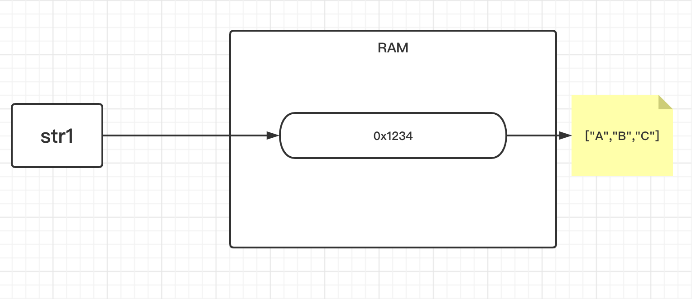
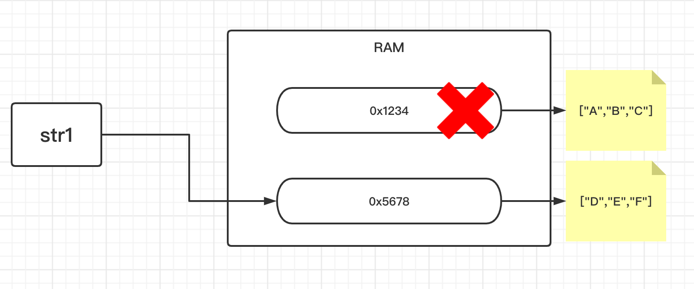
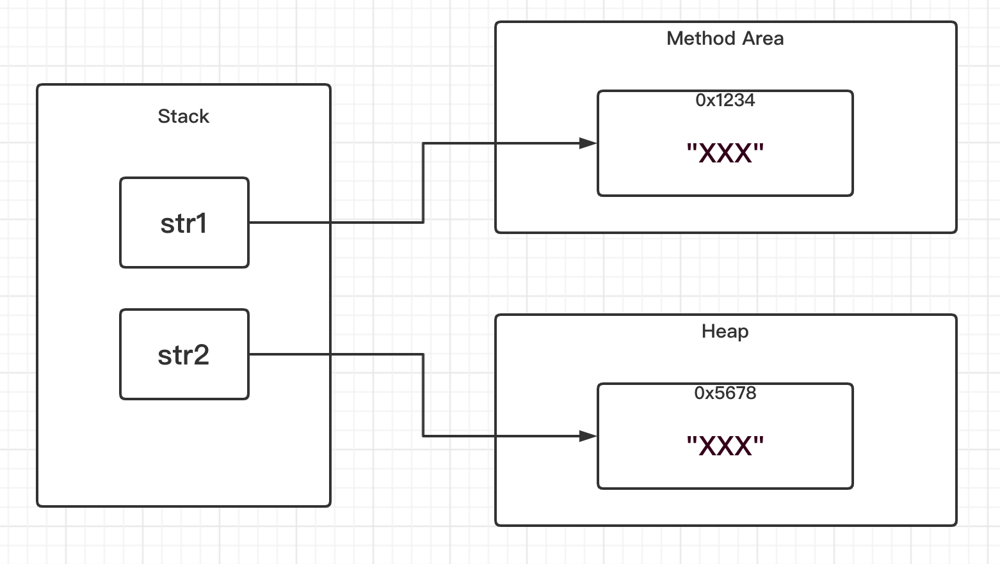
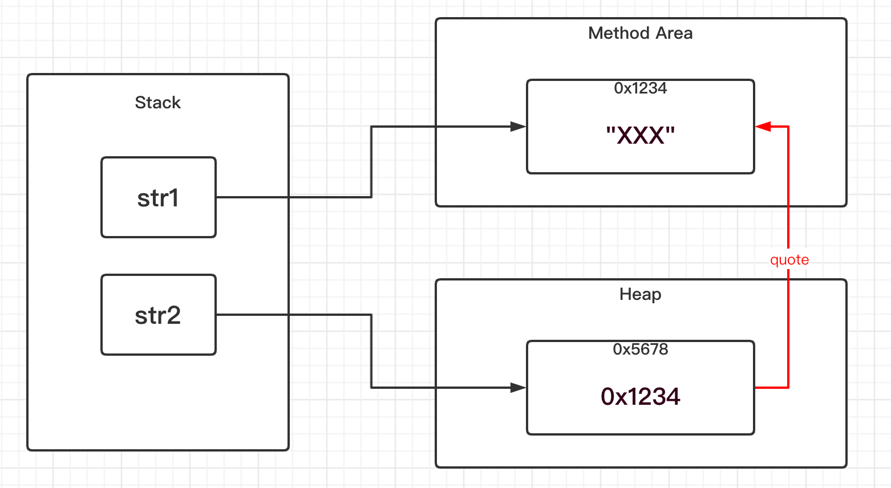
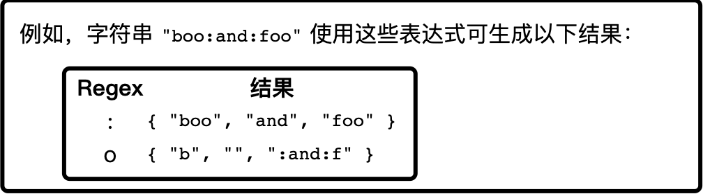

<!-- TOC -->

- [1. String 类的相关概念](#1-string-类的相关概念)
  - [1.1. String 类的存储解释](#11-string-类的存储解释)
  - [1.2. String 对象的创建](#12-string-对象的创建)
  - [1.3. String 对象两种创建方式的区别](#13-string-对象两种创建方式的区别)
  - [1.4. String 对象的空值](#14-string-对象的空值)
  - [1.5. 判断字符串非空](#15-判断字符串非空)
  - [1.6. 字符串的比较操作](#16-字符串的比较操作)
  - [1.7. 字符串相等经典例题](#17-字符串相等经典例题)
- [2. String 类常用的方法](#2-string-类常用的方法)
  - [2.1. String 的创建和转换](#21-string-的创建和转换)
    - [2.1.1. String(byte[] bytes) 构造器](#211-stringbyte-bytes-构造器)
    - [2.1.2. getBytes 方法](#212-getbytes-方法)
    - [2.1.3. String(char[] value) 构造器](#213-stringchar-value-构造器)
    - [2.1.4. toCharArray 方法](#214-tochararray-方法)
  - [2.2. 获取字符串相关的信息](#22-获取字符串相关的信息)
    - [2.2.1. length 方法](#221-length-方法)
    - [2.2.2. charAt 方法](#222-charat-方法)
    - [2.2.3. indexOf 方法](#223-indexof-方法)
    - [2.2.4. lastIndexOf 方法](#224-lastindexof-方法)
  - [2.3. 字符串比较判断](#23-字符串比较判断)
    - [2.3.1. equals 方法](#231-equals-方法)
    - [2.3.2. equalsIgnoreCase 方法](#232-equalsignorecase-方法)
    - [2.3.3. contentEquals 方法](#233-contentequals-方法)
  - [2.4. 字符串大小写转换](#24-字符串大小写转换)
    - [2.4.1. toUpperCase() 方法](#241-touppercase-方法)
    - [2.4.2. toLowerCase() 方法](#242-tolowercase-方法)
  - [2.5. 字符串的分割和截取](#25-字符串的分割和截取)
    - [2.5.1. split 方法](#251-split-方法)
    - [2.5.2. substring 方法](#252-substring-方法)
  - [2.6. 字符串的匹配判断](#26-字符串的匹配判断)
    - [2.6.1. startsWith 方法](#261-startswith-方法)
    - [2.6.2. endsWith 方法](#262-endswith-方法)
    - [2.6.3. trim 方法](#263-trim-方法)

<!-- /TOC -->

## 1. String 类的相关概念
- 不可变的字符串, 内容不可改变. 

### 1.1. String 类的存储解释
- 如下, 创建一个 `String` 类对象并对其进行操作.
  
```java
String str1 = "ABC";// 创建对象
System.out.println(str1); //输出内容为 ABC

str1 = "DEF";//改变值
System.out.println(str1); //输出内容为 DEF
```

- 在这个过程中字符串表面上并没有发生改变, 实际上在内存中它的地址指向发生改变.

- 由于 `String` 类对象等同于 `char` 类型数组, 因为底层进行了封装.  
  因此可以得出如下示意图中的内容:  
  

- 然后字符串内容发生改变之后, 相当于指向了新的 `char` 数组的内存地址.  
  改过程的本质类似于引用传值的原理.  
  

### 1.2. String 对象的创建
- 创建字符串对象有两种方式:  
  以下两种方式在内存分布中存在着区别.
  
  - 第一种是直接赋值字面量:  
    ```java
    String str1 = "xxx";
    ```
  
  - 第二种是通过构造器创建:  
    ```java
    String str2 = new String("xxx");
    ```

### 1.3. String 对象两种创建方式的区别  
- 直接赋值字面量的方式会在方法区的常量池中分配区域用于存储数据.  
- 通过构造器创建的方式则会在堆空间中分配内存区域用于存储数据.

```java
String str1 = "xxx";
String str2 = new String("xxx");
```


- 然而由于在构建 `str2` 对象时会先从方法区中的常量池进行寻找,  
  寻找是否存在 `"XXX"` 这个对象, 如果存在则直接引用它的地址即可.  

- 但如果用 `==` 进行比较是会得到 `false` 的结果, 因为比较的是内存地址.
  


**两种方法的区别总结如下**:  
  
- 直接字面量赋值的方式:  
  - 会先在常量池寻找是否存在相对应的 String 对象.  
    - 如果存在, 则直接引用地址, 此时并不会创建 String 对象;
    - 如果不存在, 则先在常量池创建对象, 再引用地址空间,  
        此时创建了一个 String 对象.  
  
  - 因此该方法最少不会创建对象, 最多会创建一个对象.

- 通过构造器创建的方式:  
  
  - 也会先在常量池中寻找是否存在相对应的 String 对象.  
    - 如果存在, 则先在堆中创建一个对象, 因为使用了构造器, 必须生成对象.  
        然后通过这个对象去引用常量池中的对象的地址, 此时创建了一个对象.
    - 如果不存在, 则先在常量池中创建一个对象, 然后再在堆中创建对象,  
        在堆中创建的对象会引用常量池中的对象的地址, 此时创建了两个对象.
  
  - 因此该方法至少创建一个对象, 最多创建两个对象.


****

### 1.4. String 对象的空值
- 表示引用为空(`null`):  
  这种情况表示没有初始化, 没有分配内存空间.
  ```java
  String str1 = null;
  ```

- 表示字符序列为空字符串(`""`):  
  这种情况表示已经初始化, 且分配了内存空间, 但内存空间中并没有数据.
  ```java
  String str2 = "";
  ```

### 1.5. 判断字符串非空
- 引用不能为空
- 字符串内容不能为空字符串

### 1.6. 字符串的比较操作
- 使用 `==` 号运算符:  
  这种方式比较的是引用的内存地址是否相同, 相同为 true.  
  ```java
  String str1 = "ABC";
  String str2 = str1;
  String str3 = "ABC";

  boolean isTrue1 = (str1 == str2); 
  boolean isTrue2 = (str1 == str3); 
  
  System.out.println(isTrue1);//输出结果 true
  System.out.println(isTrue2);//输出结果 true
  ```

- 使用 `equals` 方法:  
  - 这种方法比较的是字符串的值是否一致.  
  
  - 在 `String` 类中对 `Object` 类的 `equals` 方法进行了覆写.  
    会先对两个对象的内存地址进行比较, 如果内存地址不一样,  
    再对字符串的值进行比较. 两者满足其一则为 true.
  
  - 在对字符串的值进行比较的时候, 实际上是对其底层 char 数组的中的  
    每一个元素逐个进行匹配比较是否值是相等.
    ```java
    String str1 = new String("ABC");
    String str2 = new String("ABC");
    
    boolean isTrue1 = (str1 == str2); 
    System.out.println(isTrue1);//输出结果为 false
    
    boolean isTrue2 = str1.equals(str2); 
    System.out.println(isTrue2);//输出结果为 true
    ```

### 1.7. 字符串相等经典例题
- 题目:  
  说说下面的 String 对象彼此之间是否相等.  

- 结果:  
  在下面的代码注释中给出.

```java

private static String getXx(){
    return "AB";
}

public static void main(String args[]){
    String str1 = "ABCD";
    
    String str2 = "A" + "B" + "C" + "D";
    
    String str3 = "AB" + "CD";
    
    String str4 = new String("ABCD");
    
    String temp = "AB";
    String str5 = temp + "CD";
    
    String str6 = getXx() + "CD";


    System.out.println(str1 == str2);//true
    System.out.println(str1 == str3);//true
    System.out.println(str1 == str4);//false
    System.out.println(str1 == str5);//false
    System.out.println(str1 == str6);//false
}

```

- **针对前三个字符串 `str1, str2, str3` 相等的解释:**  
  - 在编译中存在着编译优化的问题.   
    反编译后可以看出优化过后它们指向的是常量池中同一个对象.
  
  - 因此通过包含直接量的字符串进行字符连接是在编译时期就所能够决定的,  
    可以在编译的时候确定是否有该直接量的拼接结果的字符串存在于常量池当中,  
    所以可以通过编译优化来减少内存的占用.

  - 实际编译如下:  
  ```java
  String str1 = "ABCD";
  String str2 = "ABCD";
  String str3 = "ABCD";
  ```

- **针对 `str4` 不相等给出的解释:**  
  - `==` 比较的是内存地址, 显然 `str1` 与 `str4` 的内存地址并不相同.

- **针对 `str5, str6` 不相等给出的解释:**  
  - 反编译后可以看出 `str5, str6` 分别创建了两个不同的 `StringBuilder` 对象,  
    然后两个对象再进行字符串拼接, 最后再转化为 `String` 类型的对象.  
    同时 `(str5 == str6)` 的结果也是 `false`, 因为是两个不同的对象.
    
  - 因此通过变量/方法去连接字符串, 都只能在运行时期才能确定变量的值或返回的方法值,  
    所以是不存在编译优化的问题.
  
  - 实际编译效果如下:
  ```java
  String str5 = (new StringBuilder(String.valueOf(temp))).append("CD").toString();
  String str6 = (new StringBuilder(String.valueOf(getXx()))).append("CD").toString();
  ```


## 2. String 类常用的方法

### 2.1. String 的创建和转换

#### 2.1.1. String(byte[] bytes) 构造器
- 方法定义:  
  `public String(byte[] bytes)`

- 作用:  
  通过使用平台的默认字符集解码指定的 `byte` 数组, 构造一个新的 `String`.  
  新 `String` 的长度是字符集的函数, 因此可能不等于 `byte` 数组的长度.

- 备注:  
  当给定 `byte` 在给定字符集中无效的情况下, 此构造方法的行为没有指定.  
  如果需要对解码过程进行更多控制, 则应该使用 `CharsetDecoder` 类.

#### 2.1.2. getBytes 方法
- 方法定义:  
  `public byte[] getBytes()`

- 作用:  
  使用平台的默认字符集将此 `String` 编码为 `byte` 序列,  
  并将结果存储到一个新的 `byte` 数组中然后返回.

#### 2.1.3. String(char[] value) 构造器
- 方法定义:  
  `public String(char[] value)`

- 作用:  
  分配一个新的 `String`, 使其表示字符数组参数中当前包含的字符序列.

- 备注:  
  该字符数组的内容已被复制; 后续对字符数组的修改不会影响新创建的字符串. 

#### 2.1.4. toCharArray 方法
- 方法定义:  
  `public char[] toCharArray()`

- 作用:  
  将此字符串转换为一个新的字符数组并返回.

****

### 2.2. 获取字符串相关的信息

#### 2.2.1. length 方法
- 方法定义:  
  `public int length()`  

- 作用:  
  返回此字符串的长度.

- 实例:  
  ```java
  System.out.println("ABC".length());//输出结果为 3
  ```

#### 2.2.2. charAt 方法
- 方法定义:  
  `public char charAt(int index)`

- 作用:  
  返回指定索引处的 char 值.  
  
- 备注:
  索引范围为从 0 到 `length() - 1`.  
  序列的第一个 char 值位于索引 0 处, 第二个位于索引 1 处,  
  依此类推, 这类似于数组索引.

- 实例:  
  ```java
  System.out.println("ABC".charAt(0));//输出结果为 A
  ```

#### 2.2.3. indexOf 方法
- 方法定义:  
  `public int indexOf(String str)`

- 作用:  
  返回指定子字符串在此字符串中第一次出现处的索引.  
  如果此字符串中没有这样的子字符串, 则返回 -1.

- 实例:  
  ```java
  System.out.println("ABC".indexOf("A"));//输出结果为 1
  ```

#### 2.2.4. lastIndexOf 方法
- 方法定义:  
  `public int lastIndexOf(String str)`

- 作用:  
  返回指定子字符串在此字符串中最右边出现处的索引.  
  如果此字符串中没有这样的子字符串, 则返回 -1.

- 实例:  
  ```java
  System.out.println("ABCAA".indexOf("A"));//输出结果为 5
  ```
****

### 2.3. 字符串比较判断

#### 2.3.1. equals 方法
- 方法定义:  
  `public boolean equals(Object anObject)`

- 作用:  
  将此字符串与指定的对象比较. 
  
- 备注:  
  当且仅当该参数不为`null`, 并且是与此对象表示相同字符序列的`String`对象时,  
  结果才为`true`.

- 实例:  
  ```java
  String str1 = new String("ABC");
  String str2 = new String("ABC");
  System.out.println(str1==str2);//输出结果为 false
  System.out.println(str1.equals(str2));//输出结果为 true
  ```

#### 2.3.2. equalsIgnoreCase 方法
- 方法定义:  
  `public boolean equalsIgnoreCase(String anotherString)`

- 作用:  
  将此 `String` 与另一个 `String` 比较, 不考虑大小写.  
  如果两个字符串的长度相同, 并且其中的相应字符都相等(忽略大小写),  
  则认为这两个字符串是相等的.

- 实例:  
  ```java
  String str1 = new String("ABC");
  String str2 = new String("abc");
  System.out.println(str1.equals(str2));//输出结果为 false
  System.out.println(str1.equalsIgnoreCase(str2));//输出结果为 true
  ```

#### 2.3.3. contentEquals 方法
- 方法定义:  
  `public boolean contentEquals(CharSequence cs)`

- 作用:  
  将此字符串与指定的`CharSequence`比较.   
  当且仅当此`String`与指定序列表示相同的`char`值序列时, 结果才为 true.

- 备注:  
  实质上该方法的底层和 `equals` 方法底层是相同的, 仅仅是名称不同.

- 实例:  
  ```java
  System.out.println("ABC".contentEquals("ABC"));//输出结果为 true
  ```

****

### 2.4. 字符串大小写转换

#### 2.4.1. toUpperCase() 方法
- 方法定义:  
  `public String toUpperCase()`

- 作用:  
  使用默认语言环境的规则将此 String 中的所有字符都转换为大写并返回.

- 实例:  
  ```java
  System.out.println("abc".toUpperCase());//输出结果为 ABC
  ```

#### 2.4.2. toLowerCase() 方法
- 方法定义:  
  `public String toLowerCase()`

- 作用:  
  使用默认语言环境的规则将此 String 中的所有字符都转换为小写并返回.

- 实例:  
  ```java
  System.out.println("ABC".toUpperCase());//输出结果为 abc
  ```
****

### 2.5. 字符串的分割和截取

#### 2.5.1. split 方法
- 方法定义:  
  `public String[] split(String regex)`

- 作用:  
  根据给定正则表达式的匹配拆分此字符串.

- 实例:  
  

#### 2.5.2. substring 方法
- 方法定义:  
  `public String substring(int beginIndex, int endIndex)`

- 作用:  
  返回一个新字符串, 它是此字符串的一个子字符串.  
  该子字符串从指定的 `beginIndex` 处开始,  
  直到索引 `endIndex - 1` 处的字符.  
  因此, 该子字符串的长度为 `endIndex-beginIndex`.

- 参数:  
  beginIndex - 起始索引(必填)
  endIndex - 结束索引(非必填)

- 备注:  
  如果不填结束索引, 则返回的子字符串将从指定索引处的字符开始, 直到原字符串末尾.

- 实例:  
  ```java
  "unhappy".substring(2) //returns "happy"
  "Harbison".substring(3) //returns "bison"
  "emptiness".substring(9) //returns "" (an empty string)
  
  "hamburger".substring(4, 8); //returns "urge"
  "smiles".substring(1, 5); //returns "mile"
  ```

****

### 2.6. 字符串的匹配判断

#### 2.6.1. startsWith 方法
- 方法定义:  
  `public boolean startsWith(String prefix)`

- 作用:  
  测试此字符串是否以指定的前缀开始.

- 实例:
  ```java
  System.out.println("supermarker".startsWith("super"));//输出结果为 true
  ```

#### 2.6.2. endsWith 方法
- 方法定义:  
  `public boolean endsWith(String suffix)`

- 作用:  
  测试此字符串是否以指定的后缀结束.

- 实例:  
  ```java
  System.out.println("supermarker".endsWith("marker"));//输出结果为 true
  ```

#### 2.6.3. trim 方法
- 方法定义:  
  `public String trim()`

- 作用:  
  返回字符串的副本, 忽略前导空白和尾部空白.

- 备注:  
  如果此 `String` 对象表示一个空字符序列, 或者此 `String` 对象  
  表示的字符序列的第一个和最后一个字符的代码都大于 `'\u0020'(空格字符)`,  
  则返回对此 `String` 对象的引用.