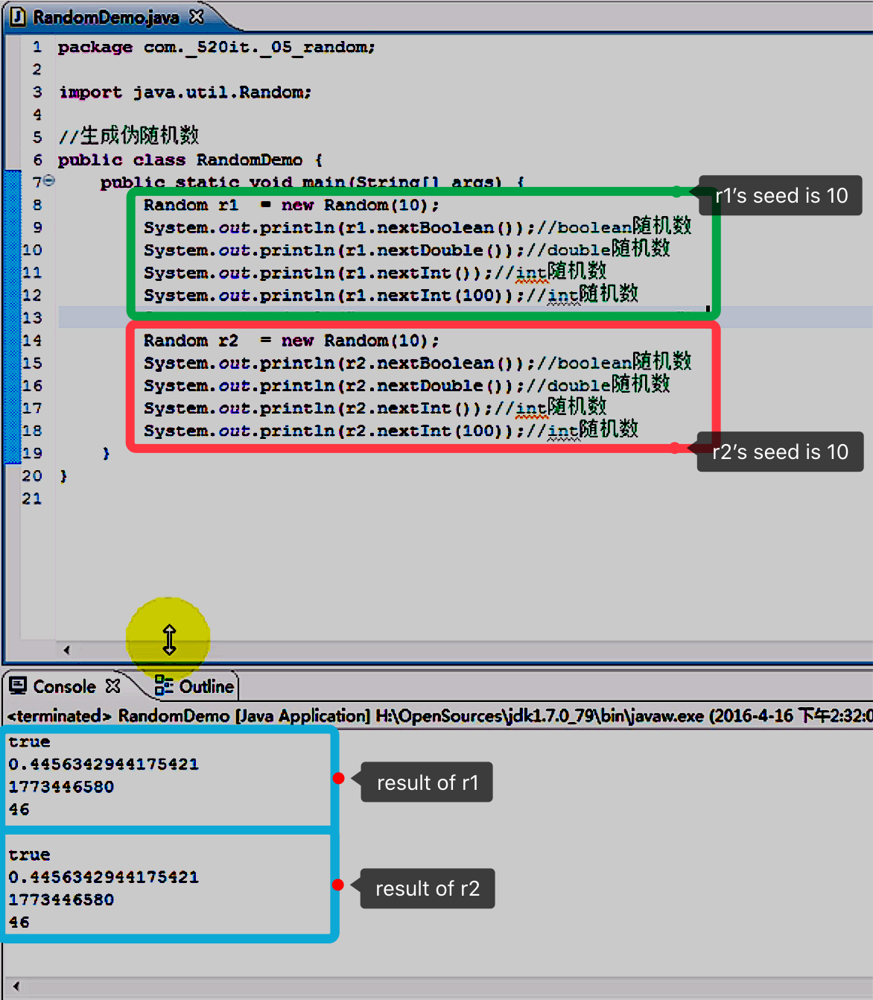

<!-- TOC -->

- [1. 随机数相关类](#1-随机数相关类)
- [2. Random 类](#2-random-类)
  - [2.1. Random 类的构造器](#21-random-类的构造器)
    - [2.1.1. Random() 构造器](#211-random-构造器)
    - [2.1.2. Random(long seed) 构造器](#212-randomlong-seed-构造器)
  - [2.2. Random 类常用方法](#22-random-类常用方法)
    - [2.2.1. nextInt(int n) 方法](#221-nextintint-n-方法)
- [3. ThreadLocalRandom 类](#3-threadlocalrandom-类)
  - [3.1. ThreadLocalRandom 类新增方法](#31-threadlocalrandom-类新增方法)
    - [3.1.1. nextInt(int least, int bound) 方法](#311-nextintint-least-int-bound-方法)
- [4. UUID 类](#4-uuid-类)
  - [4.1. UUID 类中常用方法](#41-uuid-类中常用方法)
    - [4.1.1. randomUUID 方法](#411-randomuuid-方法)
- [5. 使用案例-验证码生成](#5-使用案例-验证码生成)

<!-- /TOC -->

## 1. 随机数相关类
- 随机数相关类有以下三个
  - `Random` 类 (java.util)
  - `ThreadLocalRandom` 类 (java.util.concurrent)
  - `UUID` 类 (java.util)

## 2. Random 类
- 作用:  
  用以生成一个伪随机数. 很多时候会发现 `Math.random()` 方法更易于使用.

- 备注:  
  - 通过相同的种子产生的随机数是相同的.  
  - 无论运行多少次, 只要种子一样, 结果都不会发生改变.
  - 如下所示:  
    

****

### 2.1. Random 类的构造器

#### 2.1.1. Random() 构造器
- 方法定义:  
  `public Random()`

- 作用:  
  创建一个新的随机数生成器. 此构造方法将随机数生成器的种子设置为某个值,  
  该值与此构造方法的所有其他调用所用的值完全不同.

#### 2.1.2. Random(long seed) 构造器
- 方法定义:  
  `public Random(long seed)`

- 作用:  
  使用单个 `long` 种子创建一个新的随机数生成器.  
  该种子是伪随机数生成器的内部状态的初始值,  
  该生成器可通过方法 `next(int)` 维护.

### 2.2. Random 类常用方法

#### 2.2.1. nextInt(int n) 方法
- 方法定义:  
  `public int nextInt(int n)`

- 作用:  
  返回一个伪随机数, 它是取自此随机数生成器序列的,  
  在 `0`(包括)和指定值(不包括之间均匀分布的 `int` 值.
  
- 备注:  
  如果参数不填, 则随机生成在 `int` 范围内的有效整数.

****

## 3. ThreadLocalRandom 类 
- 该类是 jdk 1.7 中新增的类, 是 `Random` 类的子类,  
  在多线程并发的情况下, 该类相对于 `Random` 类来说,  
  可以减少多线程资源竞争, 保证了线程的安全性.

- 作用:  
  该类都可以直接调用其父类 `Random` 类中的方法.

- 备注:  
  该类是单例设计模式, 因此其构造方法是默认访问权限,  
  所以需要使用其内置的静态方法 `current()` 来返回当前类对象.

### 3.1. ThreadLocalRandom 类新增方法

#### 3.1.1. nextInt(int least, int bound) 方法
- 方法定义:  
  `public int nextInt(int least, int bound)`

- 作用:  
  返回一个在 `[least, bound)` 范围内的整数.

- 参数:  
  - least 下边界(包含)
  - bound 上边界(不包含)

## 4. UUID 类
- 作用:  
  - 表示通用唯一标识符 (`UUID`) 的类.  
  - 在一台机器上生成的数字, 它保证对在同一时空中的所有机器都是唯一的.
  - `UUID` 是一个 128 位长的数字, 一般用 16 进制表示.  
  - 算法的核心思想是结合机器的网卡, 当地的时间, 一个随机数来生成 `UUID`.
  - 唯一缺点就是结果太长, 一般用来表示随机唯一的字符串.

### 4.1. UUID 类中常用方法

#### 4.1.1. randomUUID 方法
- 方法定义:  
  `public static UUID randomUUID()`  

- 作用:  
  获取类型 4 (伪随机生成的) `UUID` 的静态工厂.  
  使用加密的强伪随机数生成器生成该 `UUID`.


## 5. 使用案例-验证码生成

```java
public static void CAPTCHA(){
    //方法1: 直接截取随机生成的UUID前五位, 
    //但这样生成的验证码缺字母, 因为是 16 进制, 最多到 'f'.
    String code = UUID.randomUUID().toString().substring(0, 5);

    //---------------------------------------------------------
    //方法2: 从整合好的字符串当中随机截取并合并结果

    //先获取大写字母组合
    String str = "ABCDEFGHIJKLMNOPQRSTUVWXYZ";
    
    //再合并小写字母组合
    str += str.toLowerCase();

    //再合并数字组合
    str += "0123456789";

    //生成StringBuilder来衔接验证码, 
    //因为目标是5位验证码, 因此直接给定大小5位即可
    StringBuilder sb = new StringBuilder(5);

    for(int i = 0; i < 5; i ++){
        //获取字符, 随机数大小必须在 [0, str.length()) 的区间内.
        Char ch = str.charAt(new Random().nextInt(str.length()));
        sb.append(ch);
    }
}
```