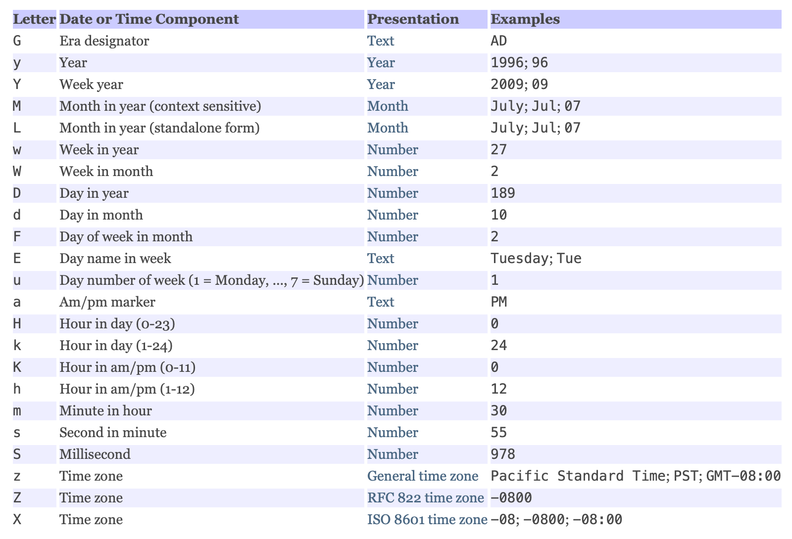

<!-- TOC -->

- [1. 日期相关类](#1-日期相关类)
- [2. Date 类](#2-date-类)
  - [2.1. 构造器](#21-构造器)
    - [2.1.1. Date() 构造器](#211-date-构造器)
    - [2.1.2. Date(long date) 构造器](#212-datelong-date-构造器)
  - [2.2. 常用方法](#22-常用方法)
    - [2.2.1. after(Date when) 方法](#221-afterdate-when-方法)
    - [2.2.2. getTime() 方法](#222-gettime-方法)
    - [2.2.3. toLocaleString() 方法](#223-tolocalestring-方法)
- [3. DateFormat 类](#3-dateformat-类)
  - [3.1. 常用方法](#31-常用方法)
    - [3.1.1. getDateInstance() 方法](#311-getdateinstance-方法)
    - [3.1.2. getInstance() 方法](#312-getinstance-方法)
    - [3.1.3. format(Date date) 方法](#313-formatdate-date-方法)
    - [3.1.4. parse(String source) 方法](#314-parsestring-source-方法)
- [4. SimpleDateFormat 类](#4-simpledateformat-类)
  - [4.1. 构造器](#41-构造器)
    - [4.1.1. SimpleDateFormat() 构造器](#411-simpledateformat-构造器)
    - [4.1.2. SimpleDateFormat(String pattern) 构造器](#412-simpledateformatstring-pattern-构造器)
  - [4.2. 常用方法](#42-常用方法)
    - [4.2.1. applyLocalizedPattern(String pattern) 方法](#421-applylocalizedpatternstring-pattern-方法)
    - [4.2.2. parse(String text, ParsePosition pos) 和 formatToCharacterIterator(Object obj) 方法](#422-parsestring-text-parseposition-pos-和-formattocharacteriteratorobject-obj-方法)
- [5. Clender 类](#5-clender-类)
  - [5.1. 常用方法](#51-常用方法)
    - [5.1.1. getInstance() 方法](#511-getinstance-方法)
    - [5.1.2. get() 方法](#512-get-方法)
    - [5.1.3. getTime() 方法 和 setTime() 方法](#513-gettime-方法-和-settime-方法)
    - [5.1.4. add() 方法](#514-add-方法)

<!-- /TOC -->

## 1. 日期相关类
- Date 类(java.util.Date)
- DateFormat/SimpleDateFormat 类(java.text.DateFormat/java.text.SimpleDateFormat)
- Calendar 类(java.util.Calendar)  

**备注**: java8 中重新为日期定义了新的 API.

## 2. Date 类
- 类 `Date` 表示特定的瞬间精确到毫秒.
- `Date` 类中的大量方法都已经过时了, 但仍可使用.  
  官方建议使用 Calendar 类进行取代.

### 2.1. 构造器

#### 2.1.1. Date() 构造器
- 方法定义:  
  `public Date()`

- 作用:  
  分配 Date 对象并初始化此对象, 以表示分配它的时间(精确到毫秒)

#### 2.1.2. Date(long date) 构造器
- 方法定义:  
  `public Date(long date)`

- 作用:  
  分配 `Date` 对象并初始化此对象, 以表示自从标准基准时间.  
  (称为"历元(epoch)", 即 1970 年 1 月 1 日 00:00:00 GMT)以来的指定毫秒数

- 参数:  
  time - 毫秒数

### 2.2. 常用方法

#### 2.2.1. after(Date when) 方法
- 方法定义:  
  `public boolean after(Date when)`

- 作用:  
  测试此日期是否在指定日期之后.

- 参数:  
  when - 日期

- 返回:  
  当且仅当此 `Date` 对象表示的瞬间比 when 表示的瞬间晚,才返回 true; 否则返回 false.

- 备注:  
  相似方法有 `before(Date when)` 作用与当前方法相反.

#### 2.2.2. getTime() 方法  
- 方法定义:   
  `public long getTime()`

- 作用:  
  返回自 1970 年 1 月 1 日 00:00:00 GMT 以来此 Date 对象表示的毫秒数.

- 实例:  
  ```java
  //创建Date对象
  java.util.Date date = new java.util.Date();

  //long类型变量转换成Date对象  
  long time = System.currentTime.Miltis();
  date = new java.util.Date(time);

  //Date对象转换成long类型变量
  long new_time = date.getTime();
  ```

#### 2.2.3. toLocaleString() 方法  
- 方法定义:   
  `public String toLocaleString()`  

- 作用:  
  返回此日期的字符串表示形式(使用语言环境约定),  
  即返回当地时间的表述样式.

- 实例:  
  ```java
  System.out.println(new java.util.Date());
  //输出结果: Mon Dec 14 15:17:30 CST 2020

  System.out.println(new java.util.Date().toLocalString);
  //输出结果: 2020-12-14 15:17:30
  ```

## 3. DateFormat 类
- `DateFormat` 是日期/时间格式化子类的抽象类,  
  它以与语言无关的方式格式化并解析日期或时间.

- 日期/时间格式化子类(如 `SimpleDateFormat`)允许进行  
  格式化(也就是日期 -> 文本), 解析(文本-> 日期)和标准化.  

- 将日期表示为 `Date` 对象, 或者表示为从 GMT 时间  
  1970 年 1 月 1 日 00:00:00 这一刻开始的毫秒数.

- 简言之就是该类有两个作用:  
  - 格式化(format): `Date` 类型对象 -> `String` 类型
  - 解析(parse): `String` 类型时间 -> `Date` 类型  

### 3.1. 常用方法 

#### 3.1.1. getDateInstance() 方法
- 方法定义:  
  `public static final DateFormat getDateInstance()`

- 作用:  
  由于 `DateFormat` 是抽象类. 同时类中有的工具方法  
  并没有定义为 `static` 静态方法.  
  因此该方法的作用是获取日期格式器,  
  该格式器具有默认语言环境的默认格式化风格.

- 备注:  
  该方法有另一带参数的重载方法, 用法类似.  
  输出的日期格式可根据给定的风格和语言环境进行格式化.  
  具体的参数可以去开发文档中进行查阅.

#### 3.1.2. getInstance() 方法
- 方法定义:  
  `public static final DateFormat getInstance()`

- 作用:  
  获取为日期和时间使用 `SHORT` 风格的默认日期/时间格式器

- 实例:  
  ```java
  Date d = new Date();
  System.out.println(d);//输出结果: Mon Dec 14 15:17:30 CST 2020
  
  //格式化操作
  DateFormat df = DateFormat.getInstance();
  String time = df.format(d);
  System.out.println(time);//输出结果 因为是 SHORT 风格, 所以得到结果为 20-12-14 下午3:17
  ```

#### 3.1.3. format(Date date) 方法
- 方法定义:  
  `public final String format(Date date)`

- 作用:  
  将一个 `Date` 格式化为日期/时间字符串.

- 参数:  
  date - 要格式化为时间字符串的时间值

#### 3.1.4. parse(String source) 方法
- 方法定义:  
  `public Date parse(String source) throws ParseException`

- 作用:  
  从给定字符串的开始解析文本, 以生成一个日期.  
  该方法不使用给定字符串的整个文本.

- 参数:  
  source - 一个 `String`, 应从其开始处进行解析.


## 4. SimpleDateFormat 类
- 来源 java.text.SimpleDateFormat
- 是 `DateFormat` 的子类, 拥有其父类的全部功能, 且支持自定义的日期格式.

### 4.1. 构造器

#### 4.1.1. SimpleDateFormat() 构造器
- 方法定义:  
  `public SimpleDateFormat()`  

- 作用:  
  构造一个 `SimpleDateFormat` 使用默认模式和日期格式符号为默认的 FORMAT 区域设置.

#### 4.1.2. SimpleDateFormat(String pattern) 构造器
- 方法定义:  
  `public SimpleDateFormat(String pattern)` 

- 作用:  
  使用给定模式 `SimpleDateFormat` 并使用默认的 FORMAT 语言环境的默认日期格式符号.  

- 参数:  
  pattern - 描述日期和时间格式的模式  
  

- 实例:  
  ```java
  //定义格式
  String pattern = "yyyy-MM-dd HH:mm:ss";
  //根据自定义格式新建格式对象
  SimpleDateFormat sdf = new SimpleDateFormat(pattern);
  String time = sdf.format(new java.util.Date());
  //输出格式, 结果为 2020-12-15 22:10:22
  System.out.println(time);
  ```

### 4.2. 常用方法

#### 4.2.1. applyLocalizedPattern(String pattern) 方法
- 方法定义:  
  `public void applyLocalizedPattern(String pattern)`

- 作用:  
  将给定的本地化模式字符串应用于此日期格式

#### 4.2.2. parse(String text, ParsePosition pos) 和 formatToCharacterIterator(Object obj) 方法
- 继承而来的方法, 用法功能与其父类一致, 不再赘述.

## 5. Clender 类
- 来源 java.util.Calendar
- `Calendar` 类是一个抽象类, 它为特定瞬间与一组诸如 YEAR/MONTH/DAY_OF_MONTH/HOUR 等  
  日历字段之间的转换提供了一些方法, 并为操作日历字段提供了一些方法.  
  瞬间可用毫秒值来表示, 它是距历元(1970/1/1 00:00:00.000)的偏移量.


### 5.1. 常用方法

#### 5.1.1. getInstance() 方法
- 定义:  
  `public static Calendar getInstance()`

- 作用:  
  使用默认时区和语言环境获得一个日历对象.

#### 5.1.2. get() 方法
- 定义:  
  `public int get(int field)`

- 作用:  
  返回给定日历字段(年/月/日/时/分/秒)的值.  
  每个字段在类中有定义常量.

- 实例:
  ```java
  Calendar c = Calendar.getInstance();
  //输出结果为 Year: 2020
  System.out.println("Year: " + c.get(Calendar.YEAR));
  ```

#### 5.1.3. getTime() 方法 和 setTime() 方法
- `Date` 类型通过 `getTime()` 转换为 `Calendar` 类型
- `Calendar` 类型通过 `setTime()` 转换为 `Date` 类型

#### 5.1.4. add() 方法
- 方法定义:  
  `public abstract void add(int field, int amount)`

- 作用:  
  根据日历的规则, 将指定的时间量添加或减去给定的日历字段.   
  例如, 要从当前日历的时间减去5天, 可以通过以下方法来实现：  
  `add(Calendar.DAY_OF_MONTH, -5)`

- 参数:  
  field - 日历字段.  
  amount - 要添加到该字段的日期或时间的数量.  

