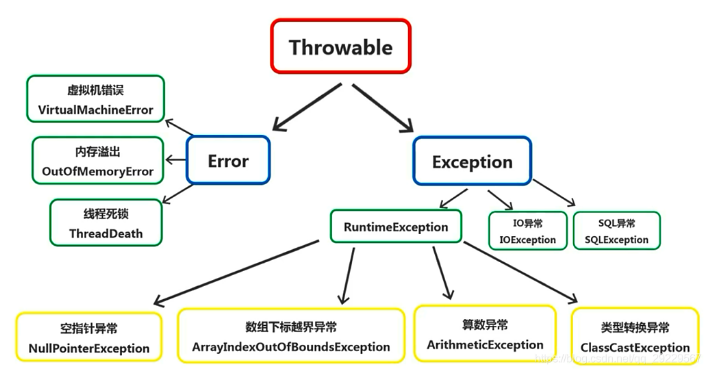

<!-- TOC -->

- [1. 异常处理机制](#1-异常处理机制)
- [2. 异常结构](#2-异常结构)
  - [2.1. Throwable 类](#21-throwable-类)
  - [2.2. 相关子类](#22-相关子类)
    - [2.2.1. Error 错误](#221-error-错误)
    - [2.2.2. Exception 异常](#222-exception-异常)
  - [2.3. 异常(Exception)的分类](#23-异常exception的分类)
- [3. 处理异常相关](#3-处理异常相关)
  - [3.1. 处理方式](#31-处理方式)
  - [3.2. 处理原则](#32-处理原则)
- [4. 异常转译和异常链](#4-异常转译和异常链)
- [5. Java7 新特性](#5-java7-新特性)

<!-- /TOC -->

## 1. 异常处理机制
**异常的定义:**  
- 异常并非指语法错误, 语法错误是无法通过编译的, 并不会产生字节码文件.

- 异常就是有异于常态, 和正常情况不一样, 有错误出现.  
  在 java 中, 阻止当前方法或作用域的情况, 称之为异常.

- 异常处理是衡量一门语言是否成熟的标准之一.

**没有异常机制所带来的问题:**  
- 使用方法的返回值所能表示的异常情况是有限的,  
  无法穷举所有的异常情况.  

- 异常流程代码和正常流程代码混合使得可读性降低

- 随着系统规模的扩大, 程序可维护性极低.

**针对没有异常机制的解决方案:**  
- 把不同类型的异常情况描述成不同类(称之为异常类)
- 分离异常流程代码和正确流程代码
- 灵活处理异常, 若当前方法无法处理, 则交由调用者处理

## 2. 异常结构

### 2.1. Throwable 类
在 Java 中, 所有的异常都有一个共同的祖先 `Throwable`(可抛出).  
`Throwable` 指定代码中可用异常传播机制通过 Java 应用程序传输的任何问题的共性.  
  

### 2.2. 相关子类
有两个重要的子类:  
- `Error`(错误)和 `Exception`(异常), 二者是异常处理的重要子类, 各自都包含大量子类.
  

#### 2.2.1. Error 错误 
- 是程序中无法处理的错误, 表示运行应用程序中出现了严重的错误.  
- 通常指 JVM 相关的不可修复的错误.
- 此类错误发生时, JVM将终止线程. 非代码性错误.  
因此, 当此类错误发生时, 不需进行处理.

#### 2.2.2. Exception 异常  
- 程序本身可以捕获并且可以处理的异常.  
- 指的是程序中出现的不正常情况.

### 2.3. 异常(Exception)的分类
- 根据在编译时期是否检查异常可以分为两类: 
  - 编译时期异常(Checked Exception):  
    在编译时期就会检查, 若没有处理, 则会编译失败.

  - 运行时期异常(Runtime Exception):  
    在运行时期进行检查, 在编译时期不会被检测到,  
    因此不会导致编译报错, 这种异常可在编译中处理或不处理.

## 3. 处理异常相关

### 3.1. 处理方式
- 该方法不处理, 而是声明抛出, 由该方法的调用者来处理(`throws`).
- 在方法中使用 `try-catch-finally` 语句块来处理异常.

### 3.2. 处理原则
- 异常只能用于非正常情况, `try-catch` 的存在会影响性能.

- 如果自定义了异常或者某个方法抛出了异常,  
  需要为异常提供说明文档, 比如 java doc.

- 尽可能避免异常(如 `NullPointerException`)

- 异常捕获应该尽量简洁的放在一个 `try-catch` 代码块中

- 不应在循环中进行异常处理, 应该在循环外对异常进行捕获处理

- 自定义异常尽量使用 `RuntimeException` 类型的

## 4. 异常转译和异常链
- 异常转译:  
  当位于最上层的子系统不需要关心底层的异常细节时,  
  常见做法是捕获原始异常, 把它转换成新的不同类型异常, 再抛出新异常.

- 异常链:  
  把原始的异常包装为新的异常类, 从而形成多个异常的有序排列,  
  有助于查找生成异常的根本原因.

## 5. Java7 新特性
- 增强的 `throw`
- 多异常捕获
- 自动资源关闭
