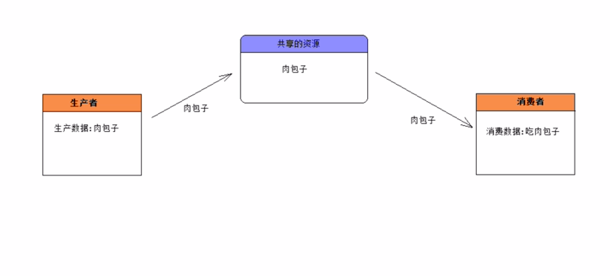
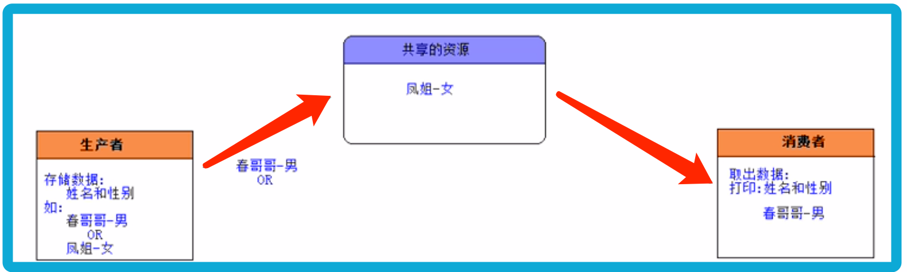
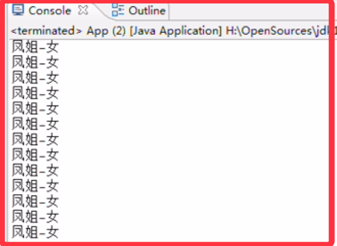
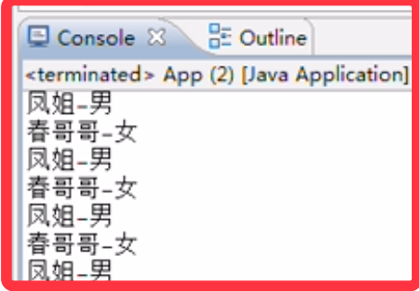
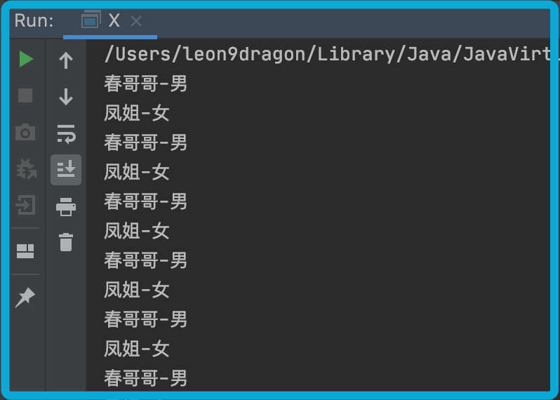

<!-- TOC -->

- [1. 线程通信的概念和实现](#1-线程通信的概念和实现)
  - [1.1. 案例释义](#11-案例释义)
    - [1.1.1. 分析示图](#111-分析示图)
    - [1.1.2. 案例描述](#112-案例描述)
    - [1.1.3. 案例实现(无同步无线程通信)](#113-案例实现无同步无线程通信)
    - [1.1.4. 实现效果与异常](#114-实现效果与异常)
    - [1.1.5. 异常分析](#115-异常分析)
    - [1.1.6. 异常解决方案](#116-异常解决方案)
- [2. 用 Object 类中的 wait 和 notify 方法实现线程通信](#2-用-object-类中的-wait-和-notify-方法实现线程通信)
  - [2.1. Object 类中常用的线程通信方法](#21-object-类中常用的线程通信方法)
  - [2.2. 通信流程](#22-通信流程)
  - [2.3. 用 wait 和 notify 方法实现消费者案例的线程通信](#23-用-wait-和-notify-方法实现消费者案例的线程通信)
- [3. Lock 机制和 Condition 接口实现线程通信](#3-lock-机制和-condition-接口实现线程通信)
  - [3.1. 锁机制的线程通信需求](#31-锁机制的线程通信需求)
    - [3.1.1. Lock 接口提供获取 Condition 实例的方法](#311-lock-接口提供获取-condition-实例的方法)
  - [3.2. Condition 接口简介](#32-condition-接口简介)
    - [3.2.1. Condition 接口中的方法](#321-condition-接口中的方法)
    - [3.2.2. 用锁机制来实现消费者案例的线程通信](#322-用锁机制来实现消费者案例的线程通信)
- [4. 线程通信中的死锁](#4-线程通信中的死锁)
  - [4.1. 死锁的产生](#41-死锁的产生)
  - [4.2. 避免死锁的法则](#42-避免死锁的法则)
  - [4.3. Thread 类中的过时方法](#43-thread-类中的过时方法)

<!-- /TOC -->

## 1. 线程通信的概念和实现
- 不同的线程执行不同的任务, 若这些任务有联系, 线程之间必须能够通信才能协调完成工作.  

### 1.1. 案例释义
- 经典的生产者和消费者案例(Producer/Consumer):


#### 1.1.1. 分析示图  
1) 生产者和消费者应该操作共享的资源(实现方式来做). 
2) 使用一个或多个线程来表示生产者(Producer).
3) 使用一个或多个线程来表示消费者(Consumer).
4) 这种将生产者/资源/消费者独立开来的设计模式体现了面向对象的思想  
   1) 实现了低耦合, 使得每件事物之间互相独立;
   2) 让生产者和消费者之间通过第三方进行交换数据, 使其互相不需引用.

#### 1.1.2. 案例描述

- 如上获取一个全新的更为详细的案例描述:
  - 生产者负责存入姓名和性别数据
  - 消费者负责取出数据并进行打印

- 对于生产者来说:  
如果共享资源中没有数据, 则生产者负责生产一个数据(姓名-性别), 共享资源为不空了.  
否则生产者等待消费者消费该数据.  

- 对于消费者来说:  
如果共享资源中没有数据, 则消费者应该等待生产者生产数据.   
否则消费者取出该数据. 共享资源为空了.

#### 1.1.3. 案例实现(无同步无线程通信)
- 共享资源类的实现
```java
//共享资源对象(姓名-性别) 
public class ShareResource {
    private String name;
    private String gender;

    /**
     * 生产者向共享资源对象中存储数据
     * @param name 存储的姓名
     * @param gender 存储的性别
     */
    public void push(String name, String gender) {
        this.name = name;
        this.gender = gender;
    }

    /**
    * 消费者从共享资源对象中取出数据
    */
    public void popup() {
        System.out.println(this.name + "-" + this.gender);
    }
}
```

- 生产者类的实现
```java
//生产者
public class Producer implements Runnable {
    //共享的资源对象, 设定为 null
    private ShareResource resource = null;

    //通过构造器将共同的共享资源传递进来 
    public Producer(ShareResource resource) {
        this.resource = resource;
    }

    public void run() {
        for (int i = 0; i < 50; i++) {
            if (i % 2 == 0) {
                resource.push("春哥哥", "男");
            } else {
                resource.push("凤姐", "女");
            }
        }
    }
}
```

- 消费者类的实现
```java
//消费者
public class Consumer implements Runnable {
    //共享的资源对象
    private ShareResource resource = null;

    public Consumer(ShareResource resource) {
        this.resource = resource;
    }

    public void run() {
        for (int i = 0; i < 50; i++) {
            resource.popup();
        }
    }
}
```

- 测试类的实现
```java
//测试代码
pablic class App {
    public static void main (String[] args) {
        //创建生产者和消费者共同的资源对象
        ShareResource resource = new ShareResource();
        //启动生产者线程
        new Thread(new Producer(resource)).start();
        //启动消费者线程
        new Thread(new Consumer(resource)).start();
    }
}
```

#### 1.1.4. 实现效果与异常
- 会发现性别出现紊乱, 没有理想效果中的一男一女交替打印.


- 然后通过在资源的存储方法中加入休眠, 则会出现性别紊乱.  
  - 修改后的代码
  ```java
  public void push(String name, String gender) {
      this.name = name;
      try {
          Thread.sleep(10);
      } catch (Exception ex) {
          ex.printStackTrace();
      }
      this.gender = gender;
  }
  ```
  - 运行结果与预设的存入结果并不一样, 甚至会有连续相同结果打印.   
    


#### 1.1.5. 异常分析
- 上述运行结果当中出现了两个异常:  
  - 异常 1:  
    出现姓别紊乱的情况.
    
  - 异常 2:   
    应该出现生产一个数据消费一个数据;  
    应该交替出现:`春哥哥-男`->`凤姐-女`->`春哥哥-男`->`凤姐-女`...

- 异常产生原因:  
  - 第一个问题是由于线程没有相互同步, 因此导致数据获取出现紊乱, 性别出现紊乱.
  - 第二个问题解决则是因为没有使用等待和唤醒机制, 因而导致没有交替执行.

#### 1.1.6. 异常解决方案
- 异常 1 的解决方案为:  
  只需要保证在生产姓名&性别的过程保持同步, 中间不能让消费者线程干扰.  
  可以使用同步代码块/同步方法/锁机制来解决这个问题.  
  ```java
    //共享资源对象(姓名-性别) 
    public class ShareResource {
        private String name;
        private String gender;

        /**
        * 生产者向共享资源对象中存储数据
        * @param name 存储的姓名
        * @param gender 存储的性别
        */
        synchronized public void push(String name, String gender) {
            try {
                this.name = name;
                Thread.sleep(10);
                this.gender = gender;
            } catch(Exception ex) {
                ex.printStackTrace();
            }
        }

        /**
        * 消费者从共享资源对象中取出数据
        */
        synchronized public void popup() {
            try {
                Thread.sleep(10);
                System.out.println(this.name + "-" + this.gender);
            } catch(Exception ex) {
                ex.printStackTrace();
            }
        }
    }
  ```

## 2. 用 Object 类中的 wait 和 notify 方法实现线程通信

### 2.1. Object 类中常用的线程通信方法
`java.lang.Object` 类提供类两类用于操作线程通信的方法.  
- `wait()` 方法:  
  调用该对象方法的线程会将其本身的同步锁释放, 然后 JVM 会把它存到等待池中,  
  该线程就开始等待由其它线程将其唤醒. 它本身并不能自行唤醒, 只能被其它线程唤醒.  

- `notify()` 方法:  
  调用该对象方法的线程会唤醒在等待池中等待的任意一个线程,  
  然后把该线程转到锁池中进行等待.  

- `notifyAll()` 方法:  
  调用该对象方法的线程会唤醒在等待池中等待的所有的线程, 并把线程转到锁池中等待.  

- 注意:  
  上述方法只能被同步监听锁对象来调用, 否则会报错 `IllegalMonitorStateException`.  

### 2.2. 通信流程
假设 `A` 线程和 `B` 线程共同操作一个 `X` 对象, 并设定 `X` 对象为同步锁,  
因此 `A  B` 线程可以通过 `X` 对象的 `wait` 和 `notify` 方法来进行通信,  
流程如下:  

- 当 `A` 线程执行 `X` 对象的同步方法时, `A` 线程持有 `X` 对象的锁,  
   此时 `B` 线程没有执行机会, 因此 `B` 线程在 `X` 对象的锁池中等待.  

- `A` 线程在同步方法中执行 `X.wait()` 方法时, `A` 线程释放 `X` 对象的锁,  
   此时 `A` 线程就会进入 `X` 对象的等待池中, 进行等待被唤醒.  

- 在 `X` 对象的锁池中等待锁的 `B` 线程在 `A` 线程释放锁之后,  
  则会获取 `X` 对象的锁, 执行 `X` 的另一个同步方法.  

- `B` 线程在同步方法中执行 `X.notify()` 方法时, `JVM` 把 `A` 线程从 `X` 对象  
   的等待池中移动到 `X` 对象的锁池中, 等待获取锁.  

- `B` 线程执行完同步方法后, 会释放 `X` 对象的锁, 于是 `A` 线程获得锁继续执行同步方法.  

### 2.3. 用 wait 和 notify 方法实现消费者案例的线程通信
- 共享资源类的实现
```java
//共享资源对象(姓名-性别) 
public class ShareResource {
    private String name;
    private String gender;

    //表示共享资源对象是否为空的状态
    private Boolean isEmpty = true;

    /**
    * 生产者向共享资源对象中存储数据
    * @param name 存储的姓名
    * @param gender 存储的性别
    */
    synchronized public void push(String name, String gender) {
        
        try {
            while(!isEmpty){
            //当共享资源非空的时候, 应该先进行等待消费者消费, 而后再进行生产
            //此时调用该方法的线程应该进入等待状态
            this.wait();
            }
            
            //-----生产开始------
            this.name = name;
            //执行等待间隔模拟延迟
            Thread.sleep(10);
            this.gender = gender;
            //-----生产结束------
            //生产完成后, 共享资源对象变为非空
            isEmpty = false;
            //唤醒消费者线程, 避免进入阻塞状态
            this.notify();
        } catch (Exception ex) {
            ex.printStackTrace();
        }
    }

    /**
    * 消费者从共享资源对象中取出数据
    */
    synchronized public void popup() {

        try {
            while(isEmpty){
            //当共享资源为空的时候, 应该先进行等待生产者生产, 而后再进行消费
            //此时调用该方法的线程应该进入等待状态
            this.wait();
            }
            
            //-----消费开始------
            System.out.println(this.name + "-" + this.gender);
            //-----消费结束------
            //消费完成后, 共享资源对象变为空
            isEmpty = true;
            //唤醒生产者线程, 避免进入阻塞状态
            this.notify();
        } catch (Exception ex) {
            ex.printStackTrace();
        }
        
    }
}
```

- 生产者类的实现/消费者类的实现/测试类的实现, 与前面的代码一致保持不变


- 执行效果:  
  显而易见, 输出结果是交替生产和消费进行的, 且线程之间的数据交互并没有发生紊乱.  
  


## 3. Lock 机制和 Condition 接口实现线程通信

### 3.1. 锁机制的线程通信需求
- 在 `Lock` 机制中并没有同步锁, 因此就没有自动获取锁和释放锁的概念.  

- 同时也因为没有同步锁, 因此在 `Lock` 机制不能调用 `wait()` 和 `notify()` 方法.

- 解决这个问题需要使用 `Condition` 接口, 该接口可用来处理 `Lock` 机制的通信控制.

#### 3.1.1. Lock 接口提供获取 Condition 实例的方法
- `newCondition()` 方法:    
  该方法由 `Lock` 接口提供, 用来返回绑定到此 `Lock` 实例的新 `Condition` 实例.

### 3.2. Condition 接口简介
- `Condition` 接口将 `Object` 类中的监视器方法(包括`wait()`, `notify()`  
  和 `notifyAll()`) 分解成截然不同的对象.  

- 这样就可通过将这些 `Condition` 对象与任意 `Lock` 对象实现组合,  
  为每个 `Lock` 对象提供多个等待 `set(wait-set)`.  

- 其中, `Lock` 机制替代了 `synchronized` 方法和语句,  
  `Condition` 接口的对象方法则替代了 `Object` 类中对象的监视器方法.

#### 3.2.1. Condition 接口中的方法
- `await() 方法:`  
   造成当前线程在接到信号或被中断之前一直处于等待状态.  

- `	signal() 方法:`  
  唤醒一个等待线程.  

- `signalAll() 方法:`  
  唤醒所有等待线程.

#### 3.2.2. 用锁机制来实现消费者案例的线程通信
- 注意:  
  进入方法时必须立刻获取锁, 否则会出现两种异常:  
  - 对 `Condition` 对象进行操作, 必须先有锁对象.
  - 要防止其它线程一起进入方法, 必须先取得锁.
  
```java
//共享资源对象(姓名-性别) 
public class ShareResource {
    private String name;
    private String gender;

    //表示共享资源对象是否为空的状态
    private Boolean isEmpty = true;

    //定义一个锁对象
    private final Lock lock = new ReentrantLock();
    //定义一个Condition接口对象
    private Condition condition = lock.newCondition();

    /**
    * 生产者向共享资源对象中存储数据
    * @param name 存储的姓名
    * @param gender 存储的性别
    */
    public void push(String name, String gender) {
        //进入方法后立即获取锁
        lock.lock();

        try {
            while (!isEmpty){
                //非空的时候等待消费者消费
                condition.await();
            }
            this.name = name;
            Thread.sleep(10);
            this.gender = gender;
            //生产结束唤醒其他线程以及改变资源对象状态
            condition.signalAll();
            isEmpty = false;
        } catch(Exception ex) {
            ex.printStackTrace();
        } finally {
            //执行完后释放锁
            lock.unlock();
        }
    }

    /**
    * 消费者从共享资源对象中取出数据
    */
    public void popup() {
        //进入方法后立即获取锁
        lock.lock();

        try {
            while (isEmpty){
                //空的时候等待生产者生产
                condition.await();
            }
            Thread.sleep(10);
            System.out.println(this.name + "-" + this.gender);
            //消费结束唤醒其他线程以及改变资源对象状态
            condition.signalAll();
            isEmpty = true;
        } catch(Exception ex) {
            ex.printStackTrace();
        } finally {
            //执行完后释放锁
            lock.unlock();
        }
    }
}
```

## 4. 线程通信中的死锁
- 多线程通信的时候很容易造成死锁, 死锁无法解决, 只能避免.

### 4.1. 死锁的产生  
- 当 A 线程等待由 B 线程持有的锁, 而 B 线程正在等待 A 线程持有的锁时,  
  会发生死锁现象, JVM 不会去检测或避免死锁, 所以必须在编写的时候规避.

### 4.2. 避免死锁的法则  
- 当多个线程都要访问共享资源 A/B/C 时, 保证每个线程都按照  
  相同的顺序去访问它们, 比如都先访问 A, 接着 B, 最后 C.

### 4.3. Thread 类中的过时方法
- `suspend()` 方法:  
  使正在运行的线程放弃 CPU, 暂停运行.

- `resume()` 方法:  
  使暂停的线程恢复运行.

- 过时原因:  
  因为容易导致死锁, 因此被废弃.

- 死锁原因:  
  假设 A 线程获得了对象锁, 同时在执行一个同步方法,  
  而此时 B 线程调用 A 线程的 `suspend()` 方法暂停 A 线程,  
  因此 A 线程会暂停运行并放弃 CPU, 但 A 线程不会释放同步锁.  
  因此造成了死锁, 导致 B 线程无法在后续执行过程中获取同步锁.  