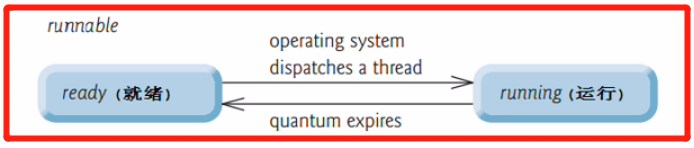

<!-- TOC -->

- [1. 线程的生命周期](#1-线程的生命周期)
  - [1.1. 线程生命周期状态图](#11-线程生命周期状态图)
  - [1.2. 线程生命周期的各个状态](#12-线程生命周期的各个状态)
    - [1.2.1. 新建状态(new)](#121-新建状态new)
    - [1.2.2. 可运行状态(runnable)](#122-可运行状态runnable)
    - [1.2.3. 阻塞状态(blocked)](#123-阻塞状态blocked)
    - [1.2.4. 等待状态(waiting)](#124-等待状态waiting)
    - [1.2.5. 计时等待状态(timed-waiting)](#125-计时等待状态timed-waiting)
    - [1.2.6. 终止状态(terminated)](#126-终止状态terminated)

<!-- /TOC -->

## 1. 线程的生命周期  

### 1.1. 线程生命周期状态图
- 线程对象的状态是存放在 `Thread` 类的内部类 `State` 中.

- `State` 类是一个枚举类, 因为状态是固定不需修改的, 所以使用枚举类型存放.  
  

- 如下是根据枚举类中 6 种状态进行定义的线程状态图
  

### 1.2. 线程生命周期的各个状态
  

#### 1.2.1. 新建状态(new)
- 使用 `new` 创建一个线程对象, 仅仅在堆中分配内存空间

- 新建状态下, 线程并没有启动, 只是存在一个线程对象而已  
  例如 `Thread t = new Thread()` 中 `t` 就属于新建状态.

- 因此新建状态是在调用线程对象的 `start()` 方法之前的.

#### 1.2.2. 可运行状态(runnable)
- 当新建状态下的线程对象调用了 `start()` 方法后, 线程就进入了可运行状态.

- 分成两种状态: `ready` 和 `running`. 分别对应的是就绪状态和运行状态.  
  
  - 就绪状态:  
  线程对象调用 `start()` 方法后, 等待 JVM 调动, 此时线程没有运行.  
  - 运行状态:  
  线程对象获得 JVM 调度, 如果存在多个 CPU 那么运行多个线程并行运行.

- 注意:  
  线程对象的 `start()` 方法只能调用一次, 否则报错: `IllegalThreadStateException`.

#### 1.2.3. 阻塞状态(blocked)
- 正在运行的线程因为某些原因放弃 CPU, 暂时暂停运行, 就会进入阻塞状态.  

- 此时 JVM 不会给线程分配 CPU, 直到线程重新进入就绪状态, 才有机会转回运行状态.  

- 消除阻塞状态后只能先进入就绪状态, 不能直接进入运行状态.

- 进入阻塞状态的两种情况:  
  1. 当 A 线程处于运行过程时, 试图获取同步锁的时候, 却被 B 线程获取.  
    此时 JVM 把当前 A 线程存到对象的锁池中, A 线程进入阻塞状态.

  2. 当线程处于运行过程中时, 发出了 IO 请求时, 此时线程进入阻塞状态.

#### 1.2.4. 等待状态(waiting)
- 等待状态只能被其它线程唤醒, 否则会永久等待下去.  

- 进入等待状态的两种情况: 
  1. 当线程处于运行过程时, 同步对象调用了 `wait()` 方法,  
     此时 JVM 把当前线程存在对象等待池中进行等待.
  2. 当线程对象调用了 `sleep()` 方法时也会进入等待状态.

#### 1.2.5. 计时等待状态(timed-waiting)
- 计时等待状态会让线程在给定时间内进入等待状态, 而后会被唤醒.  

- 进入计时等待状态的两种情况:  
  1. 当线程处于运行过程时, 同步对象调用了 `wait(long time)` 方法,  
     此时 JVM 把当前线程存在对象等待池中进行等待.
  2. 当线程对象调用了 `sleep(long time)` 方法时也会进入计时等待状态.

#### 1.2.6. 终止状态(terminated)
- 通常称为死亡状态, 表示线程终止.  

- 线程一旦终止就不能重新启动, 否则会出现异常.

- 进入终止状态的两种情况:  
  1. 正常执行完 `run` 方法后终止(正常死亡).
  2. 遇到异常而终止(出现异常后程序中断).

