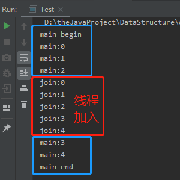

<!-- TOC -->

- [1. 线程控制操作](#1-线程控制操作)
  - [1.1. 线程休眠](#11-线程休眠)
  - [1.2. 联合线程](#12-联合线程)
    - [1.2.1. 联合线程实例:](#121-联合线程实例)
  - [1.3. 后台线程](#13-后台线程)
    - [1.3.1. 后台线程的特点](#131-后台线程的特点)
    - [1.3.2. 设置和检测后台线程的方式](#132-设置和检测后台线程的方式)
- [2. 线程优先级相关的线程操作](#2-线程优先级相关的线程操作)
  - [2.1. 线程优先级的概念](#21-线程优先级的概念)
    - [2.1.1. 线程优先级相关方法](#211-线程优先级相关方法)
    - [2.1.2. 线程优先级的划分](#212-线程优先级的划分)
  - [2.2. 线程礼让](#22-线程礼让)
    - [2.2.1. yield() 方法](#221-yield-方法)
    - [2.2.2. sleep() 方法和 yield() 方法的区别](#222-sleep-方法和-yield-方法的区别)

<!-- /TOC -->

## 1. 线程控制操作

### 1.1. 线程休眠
- 线程休眠会让执行的线程暂停一段时间, 进入计时等待状态.

- 通常会进行调用的方法是 `static void sleep(long mills)`  
  该方法位于 `java.lang.Thread` 当中, 是线程对象方法.

- 调用 `sleep()` 方法后, 当前线程放弃 CPU, 并在指定时间段内,  
  该调用 `sleep()` 方法的线程会进入等待池且不会获得执行的机会,  
  不过在此状态下, 睡眠的线程是不会释放同步锁/同步监听器的.

- 该方法通常用于模拟网络延迟, 让多线程并发访问同一个资源的错误效果更明显.   

### 1.2. 联合线程
- 线程的 `join()` 方法表示一个线程等待另一个线程完成后才执行.  
  
- `join()` 方法被插入的线程对象调用之后, 原线程对象会处于阻塞状态,  
  直到插入的线程执行完毕后, 原线程才会恢复运行.

- 称为联合线程是因为可以把调用 `join()` 方法的线程对象  
  和包含该线程对象的方法所属的线程对象联合在一起.

#### 1.2.1. 联合线程实例:  
- 将在主线程中插入一个新线程.  
  ```java
  class Join extends Thread {
      public void run() {
          for (int i = 0; i < 5; i++) {
              System.out.println("join:" + i);
          }
      }
  }

  public class Test {
      public static void main(String[] args) throws InterruptedException {
          Join joinThread = new Join();
          System.out.println("main begin");
          for (int i = 0; i < 5; i++) {
              System.out.println("main:" + i);
              if (i == 2) {
                  joinThread.start();
                  joinThread.join();
              }
          }
          System.out.println("main end");
      }
  }
  ```

- 效果图示:  
  如下图所示, 原主线程将会在插入线程执行完毕后, 再继续执行.  
  


### 1.3. 后台线程
- 指的是在后台运行的线程, 其目的是为其它线程提供服务, 也被称作"守护线程".
- JVM 的垃圾回收线程就是典型的后台线程.

#### 1.3.1. 后台线程的特点
1. 若所有的前台线程都死亡, 后台线程自动死亡;

2. 若仍有前台线程没有结束, 后台线程也不会结束.

3. 后台线程在前台线程死亡后需要一定时间进行检测,   
  因此前台线程死亡后, 后台线程可能不会立刻结束.

#### 1.3.2. 设置和检测后台线程的方式
- 检测线程对象是否为后台线程的方法:  
  - 使用 `Thread.isDaemon()` 方法.

- 前台线程创建新线程默认是前台线程, 可通过 `setDaemon()` 方法设为后台线程.  
- 同时当且仅当后台线程创建新的线程时, 新线程才是后台线程.

- 设置后台线程的方法:  
  - 令线程对象调用 `Thread.setDaemon(true)` , 参数为 `true`.

  - 调用 `setDaemon()` 方法必须在调用 `start()` 方法之前进行,  
    否则将会出现 `IllegalThreadStateException` 异常提示.

## 2. 线程优先级相关的线程操作

### 2.1. 线程优先级的概念
- 每个线程都有优先级, 优先级的高低只和线程获得执行机会的次数多少有关.  

- 并非线程优先级越高就一定先执行, 哪个线程的先运行取决于 CPU 的调度.  

- 因此线程优先级越高, 它的执行次数就越多, CPU 调度的资源也越多, 反之同理.

#### 2.1.1. 线程优先级相关方法
- 在 `Thread` 类中提供了一对 `get/set` 方法:
  - 返回线程的优先级: `int getPriority()`
  - 更改线程的优先级: `void	setPriority(int newPriority)`

#### 2.1.2. 线程优先级的划分  
- 线程优先级分为如下 3 个等级: 
  - `MAX_PRIORITY = 10`, 最高优先级;
  - `MIN_PRIORITY = 1`, 最低优先级;
  - `NORM_PRIORITY = 5`, 默认优先级.

- 线程优先级的设定:
  - 主线程默认优先级为 5;

  - 若 A 线程创建了 B 线程, 那么 A 和 B 线程优先级相同.

  - 使用 `setPriority()` 方法时, 传入整数范围应该为 `1 <= n <= 10`

- 注意:  
  不同操作系统支持的线程优先级不同的, 建议使用上述三个优先级, 不必自定义.
  

### 2.2. 线程礼让
- `Thread` 类中存在一个方法可以使调用的线程将 CPU 资源让给其他线程.

- 但在 JAVA7 提供的文档可以看出, 开发中很少会使用该方法,  
  主要用在调试和测试, 有助于解决多线程竞争条件下的错误重现现象.

#### 2.2.1. yield() 方法
- 定义:  
  `public static void yield()`

- 作用:  
  暂停当前正在执行的线程对象, 并执行其他线程.

- 注意:  
  - 该方法表示当前线程对象提示调度器自愿让出 CPU 资源,  
    但结果交由调度器自由选择, 可忽略提示或执行要求.

  - 造成这种结果是因为调用该方法后, 线程会进入就绪状态,  
    该线程就会开始与其它线程一起重新抢夺 CPU 资源,  
    因此有可能在调用该方法后, 只要抢到了资源就可再次执行.

#### 2.2.2. sleep() 方法和 yield() 方法的区别
- 都能使当前处于运行状态的线程放弃 CPU, 将运行机会让给其它线程.  

- 从其它线程获得的运行机会上来讲:
  
  - 执行 `sleep()` 方法后会给其它线程运行机会, 但不会考虑其它线程的优先级.  

  - 执行 `yield()` 方法后只会给相同优先级或更高优先级的线程运行机会.

- 从当前线程是否参与资源抢夺上来讲:  
  
  - 调用 `sleep()` 方法后线程会进入计时等待状态, 该状态下线程不能参与资源抢夺;
      
  - 调用 `yield()` 方法后线程会进入就绪状态, 该状态下线程可以参与资源抢夺.