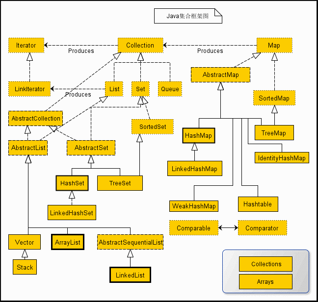
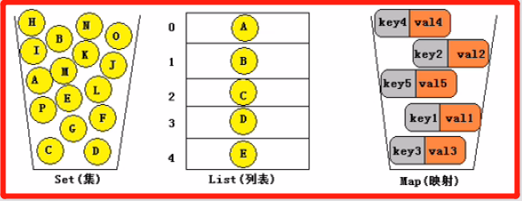

<!-- TOC -->

- [1. 集合框架的概述](#1-集合框架的概述)
  - [1.1. 集合框架关系图](#11-集合框架关系图)
  - [1.2. 常用的框架接口规范](#12-常用的框架接口规范)
  - [1.3. 常用的集合类](#13-常用的集合类)
  - [1.4. 集合中常用的操作方法](#14-集合中常用的操作方法)
    - [1.4.1. 增加](#141-增加)
    - [1.4.2. 删除](#142-删除)
    - [1.4.3. 修改](#143-修改)
    - [1.4.4. 查询](#144-查询)

<!-- /TOC -->

## 1. 集合框架的概述
- JAVA2之前, JAVA中并没有完整的集合框架, 只有一些简单的可自拓展的容器类,  
  比如 `Vector, Stack, Hashtable` 等类. 尽管这些可自拓展的容器类很好用,  
  但并不能进行集中和统一的管理.

- 集合框架是为表示和操作集合而规定的一种统一的标准的体系结构.  

- 任何集合框架都包含三部分内容: 
  - 对外的接口; 
  - 接口的实现;
  - 对集合运算的算法(底层对应某一数据结构的算法).

- 集合框架的必要性:  
  - 提供功能的复用(所有集合框架和接口都存在 `java.util` 包中);
  - 使用户专注于业务开发, 而非数据结构和算法(体现封装思想).

- 集合中存储的数据:
  - 集合中存储的对象称之为集合元素.
  - 集合中所存储的必须是对象, 不能是基本数据类型.  
    但实际上编译不会出错是因为 JAVA5 之后包含自动装箱的操作.
  - 集合类中存储的对象, 是对象的引用而非对象本身.

### 1.1. 集合框架关系图

### 1.2. 常用的框架接口规范
- 下面图片中将列出一些常见的框架接口

|接口|描述|
|--|--|
|Collection|是存放一组单值的最大接口, 所谓的单值是指集合中的每个元素都是一个对象. 一般很少会直接使用此接口直接操作|
|List|是 Collecttion 接口的子接口, 对 Collection 接口进行了大量扩充. 此接口能够精确的控制每个元素插入的位置, 能够通过索引来访问 List 中的元素. 里面存放的元素是允许重复的.|
|Set|是 Collecttion 接口的子类, 没有对 Collection 接口进行扩充, 只是行为上不一样. 里面不允许存放重复内容.|
|SortedSet|继承于 Set 接口, 是单值的排序接口, 实现此接口的集合类, 里面的内容是可排序的, 使用比较器排序.|
|Map|是存放一对值的最大接口, 接口中每个元素都是一组键值对象, 提供 key 到 value 的映射.|
|SortedMap|继承于 Map 接口, 是存放一对值的排序接口, 实现此接口的集合类, 里面的内容按照 key 排序, 使用比较器排序.|
|Map.Entry|是一个 Map 的内部接口. 每个 Map.Entry 都保存着一个元素(键/值对). 每个 Map 接口中都保存着多个 Map.Entry 的实例.|
|Queue|队列接口, 此接口的子类可以实现队列操作.|
|Iterator|集合的输出接口, 用于输出集合中的内容, 只能进行从前到后的单向输出.|
|ListIterator|是 Iterator 的子接口, 可以进行双向输出.|
|Enumeration|是最早的输出接口, 用于输出指定集合中的内容, 通过它可以枚举(一次获得一个)对象集合中的元素, 这个传统接口已被迭代器取代.|

### 1.3. 常用的集合类

- 如上图所示, `Collection` 接口中最重要的三个接口如下所示:
  - `Set`(集):  
    集合中的对象不按特定方式排序, 不允许元素重复.
  
  - `List`(列表):  
    集合中的对象按照索引位置排序, 允许元素重复.
  
  - `Map`(映射):  
    集合中每一个元素都是一对键值对(`key-value`),  
    不允许`key`重复, 允许`value`重复.

### 1.4. 集合中常用的操作方法

#### 1.4.1. 增加
- `boolean add(E e)` 方法:  
  - 作用:  
    将指定元素添加到此向量的末尾

- `void	add(int index, E element)` 方法:  
  - 作用:  
    在此向量的指定位置插入指定的元素

- `boolean addAll(Collection<? extends E> c)` 方法:  
  - 作用:  
    将指定 `Collection` 中的所有元素添加到此向量的末尾.

#### 1.4.2. 删除
- `E remove(int index)` 方法:  
  - 作用:  
    移除此向量中指定位置的元素

- `boolean remove(Object o)` 方法:  
  - 作用:  
    移除此向量中指定元素的第一个匹配项,  
    如果向量不包含该元素, 则元素保持不变.

- `boolean removeAll(Collection<?> c)` 方法:  
  - 作用:  
    此向量中移除包含在指定 `Collection` 中的所有元素

- `boolean retainAll(Collection<?> c)` 方法:  
  - 作用:  
    在此向量中仅保留包含在指定 `Collection` 中的元素.  
    实际上是用来取两个向量中的交集.

#### 1.4.3. 修改
- `E set(int index, E element)` 方法:  
  - 作用:  
    用指定的元素替换此向量中指定位置处的元素.  
    并返回被替换的旧元素.

#### 1.4.4. 查询
- `int size()` 方法:  
  - 作用:  
    返回此向量中的元素个数.

- ` boolean isEmpty()` 方法:  
  - 作用:  
    测试此向量是否不包含元素.

- `E get(int index)` 方法:  
  - 作用:  
    返回向量中指定位置的元素

- `<T> T[] toArray(T[] a)` 方法:  
  - 作用:  
    返回一个数组, 包含此向量中以恰当顺序存放的所有元素;  
    返回数组的运行时类型为指定数组的类型.