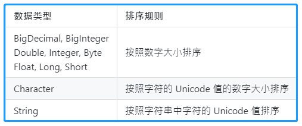

<!-- TOC -->

- [1. Set 接口及其实现类](#1-set-接口及其实现类)
  - [1.1. HashSet 类](#11-hashset-类)
    - [1.1.1. HashSet 集合自带的一些方法](#111-hashset-集合自带的一些方法)
    - [1.1.2. HashSet 集合判断元素相同的原理](#112-hashset-集合判断元素相同的原理)
    - [1.1.3. HashSet 集合调整元素存放位置的原理](#113-hashset-集合调整元素存放位置的原理)
  - [1.2. LinkedHashSet 类](#12-linkedhashset-类)
    - [1.2.1. LinkedHashSet 类的插入顺序注意事项](#121-linkedhashset-类的插入顺序注意事项)
  - [1.3. TreeSet 类](#13-treeset-类)
    - [1.3.1. TreeSet 类的一些自带方法](#131-treeset-类的一些自带方法)
    - [1.3.2. TreeSet 的排序规则](#132-treeset-的排序规则)
- [2. Set 接口实现类性能和特点分析](#2-set-接口实现类性能和特点分析)
  - [2.1. 实现类的特点](#21-实现类的特点)

<!-- /TOC -->

## 1. Set 接口及其实现类
- 一个不包含重复元素的 `collection`. 此接口模仿了数学上的 `set` 抽象.

- `Set` 只包含从 `Collection` 继承的方法, 且无法记录元素添加顺序, 不能包含重复元素.  

- `Set` 不记录加入元素的位置顺序, 是因为集合会根据元素的 `HashCode` 来计算其存放位置.  
  因此会导致将 `Set` 进行打印输出时, 得到的元素排序与加入时的顺序是不一致的.

- 当试图添加两个相同元素进 `Set` 集合, 会使得添加操作失败, `add()` 方法返回 `false`. 

- `Set` 判断两个对象是否相等用 `equals()` 方法, 而不是使用 `==` 操作符进行判断.   
  也就是说两个对象 `equals()` 比较返回 `true`, `Set` 集合是不会接受那个重复对象的. 

### 1.1. HashSet 类
- 此类是 `Set` 接口最常用的实现类, 由哈希表(实际上是一个 `HashMap` 实例)支持.  
- 其底层实际上也是一个数组, 其存在的意义在于提高查询速度以及少批量数据的插入速度.
- 它不保证 `set` 的迭代顺序, 特别是它不保证该顺序恒久不变. 
- 此类允许使用 `null` 元素.

#### 1.1.1. HashSet 集合自带的一些方法
- `clear()` 方法:  
  - 定义:  
    `public void clear()` 
  - 作用:  
    从此 `set` 中移除所有元素. 此调用返回后, 该 `set` 将为空. 

- `contains()` 方法 
  - 定义:  
    `public boolean contains(Object o)`  
  - 作用:  
    如果此 `set` 包含指定元素, 则返回 `true`.   
  - 备注:  
    更确切地讲, 当且仅当此 `set` 包含一个满足  
    `(o==null ? e==null : o.equals(e))` 的 `e` 元素时, 返回 `true`. 

- `iterator()` 方法:  
  - 定义:  
    `public Iterator<E> iterator()`  
  - 作用:  
    返回对此 set 中元素进行迭代的迭代器. 返回元素的顺序并不是特定的.

#### 1.1.2. HashSet 集合判断元素相同的原理
- `HashSet` 集合判断两个元素相等的标准, 二者必须同时满足:  
  1) 两个对象的 `equals()` 比较相等.
  2) 两个对象的 `hashCode()` 方法返回值相等.  

- 当往 `HashSet` 集合中添加新的对象的时候先会判断该对象和集合对象中的 `hashCode` 值: 
  - 不等: 直接把该新的对象存储到 `hashCode` 指定的位置.
  - 相等: 再继续判断新对象和集合对象中的 `equals` 做比较.
     - `hashCode` 相同, `equals` 为 `true`:  
       则视为是同一个对象, 则不保存在哈希表中.
     - `hashCode` 相同, `equals` 为 `false`:  
       则存储在之前对象同槽位的链表上(操作十分麻烦, 应该避免).

- 因此存储在哈希表中的自定义对象都应在其类中覆盖 `equals()` 和 `hashCode()` 方法,  
  并且保证在设定条件下 `equals()` 方法判断相等时 `hashCode()` 方法判断也应该相等.  
  以防止在同一个槽位上产生链表.  

- 可通过编译器在对象所属的自定义类中自动根据设置的条件来生成和覆盖这两个方法.

#### 1.1.3. HashSet 集合调整元素存放位置的原理
- 当向 `HashSet` 集合中存入一个新的元素时, `HashSet` 会先调用该对象的 `hashCode` 方法  
  来得到该对象的 `hashCode` 值然后决定该对象在 `HashSet` 中的存储位置.  

- 如果两个元素通过 `equals() `方法比较返回 `true`, 但他们的 `hashCode` 值不等,  
  那么 `HashSet` 会把两个元素存储在不同的位置.  

### 1.2. LinkedHashSet 类
- 此类是具有可预知迭代顺序的 `Set` 接口的哈希表和链表的实现.  

- 此类与 `HashSet` 的不同之外在于: 此类需要维护着一个运行于所有条目的双向链表,  
  因此性能相对较低, 因为维护双向链表需要消耗更多的性能.  

- 链表定义了迭代顺序, 即按照将元素插入到 `set` 中的顺序(插入顺序)进行迭代.  

#### 1.2.1. LinkedHashSet 类的插入顺序注意事项  
- 插入顺序不受在 `set` 中重新插入的元素的影响.  
  如果在 `s.contains(e)` 返回 `true` 后立即调用 `s.add(e)`,  
  则元素 `e` 会被重新插入到 `set s` 中. 

### 1.3. TreeSet 类
- 此类是基于 `TreeMap` 的 `NavigableSet` 实现. 使用元素的自然顺序对元素进行排序,  
  或者根据创建 `set` 时提供的 `Comparator` 进行排序, 具体取决于使用的构造方法.  

- 该类底层使用的是红黑树算法, 会对存储的元素进行从小到大的自然顺序排序,  
  因此必须保证 `TreeSet` 集合中的对象数据类型相同, 这样元素间才有可比性.

#### 1.3.1. TreeSet 类的一些自带方法
- `first()` 方法:  
  - 定义:  
    `public E first()`
  - 作用:  
    返回此 `set` 中当前第一个(最低)元素.

- `last()` 方法:  
  - 定义:  
    `public E last()`
  - 作用:  
  返回此 `set` 中当最后一个(最高)元素.

- `tailSet(E fromElement)` 方法:  
  - 定义:  
    `public SortedSet<E> tailSet(E fromElement)`
  - 作用:  
    返回此 `set` 的部分视图, 其元素大于等于 `fromElement`.
  - 注意:  
    - 返回的 `set` 受此 `set` 支持, 所以在返回 `set` 中的更改将反映在此 `set` 中,   
    反之亦然. 返回的 `set` 支持此 `set` 支持的所有可选 `set` 操作.  
    
    - 如果试图在返回 `set` 的范围之外插入元素, 则返回的 `set` 将抛出  
      `IllegalArgumentException` 异常.  

- `headSet(E toElement)` 方法:  
  - 定义:  
    `public SortedSet<E> headSet(E toElement)` 
  - 作用:  
    返回此 `set` 的部分视图, 其元素严格小于 `toElement`.

#### 1.3.2. TreeSet 的排序规则
- 自然排序:  
  - `TreeSet` 调用集合元素的 `compareTo()` 方法来比较元素的大小关系.  
    然后将集合元素按照升序排列, 即从小到大排序.  
  
  - 排序实现前提是 `TreeSet` 集合中元素所属类实现 `java.util.Comparable` 接口.   
    然后覆盖 `public int compare(Object o)` 再编写比较规则.

  - 在 `compare(Object o)` 方法中, 会与当前对象 `this` 和参数对象 `o` 作比较  
    (实际上其实是比较对象的属性或数据, 比如年龄则比较(`this.age` 和 `o.age`))  
    在该比较方法中会存在三种情况:  
    - `this > o`: 返回正整数(1);
    - `this < o`: 返回负整数(-1);
    - `this == o`: 返回整数零(0);

  - 各种数据类型的排序规则如下:  
    

- 定制排序:  
  - 先自定义一个比较器类实现 `java.lang.Comparator` 接口.

  - 在比较器类中覆盖 `public int compare(Object o1, Object o2)` 方法,  
    然后根据需求对对象的属性或数据进行编写比较规则.

  - 在 `TreeSet` 构造器中传递 `java.lang.Comparator` 对象.  
  
    
## 2. Set 接口实现类性能和特点分析 
- 所有 `Set` 接口的实现类都有如下特点 
  - 都不允许元素重复
  - 都不是线程安全的类

### 2.1. 实现类的特点
- `HashSet` 类:  
  - 不会记录元素先后添加顺序
  - 底层采用哈希表算法, 等值查询效率高
  - 需要覆盖方法来判断元素是否相等

- `LinkedHashSet` 类:  
  - `HashSet` 的子类, 底层增加链表算法来记录元素添加顺序
  - 判断元素是否相同也和 `HashSet` 一样要覆盖方法
  - 因为需要额外链表存储元素顺序, 因此性能没有 `HashSet` 高

- `TreeSet` 类:  
  - 不记录元素先后添加顺序, 但会对加入元素做排序操作
  - 底层采用红黑树算法, 范围查询效率较高
  - 其排序分为自然排序和定制排序, 只能选其一
  - 判断元素是否相同根据其比较器返回结果是否为 0 决定