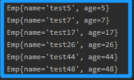
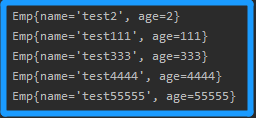
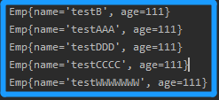

<!-- TOC -->

- [1. 集合的排序规则](#1-集合的排序规则)
  - [1.1. Comparable 接口](#11-comparable-接口)
    - [1.1.1. Comparable 比较方法的排序规则](#111-comparable-比较方法的排序规则)
    - [1.1.2. 实现案例](#112-实现案例)
  - [1.2. Comparator 接口](#12-comparator-接口)
    - [1.2.1. 匿名内部类实现案例](#121-匿名内部类实现案例)
    - [1.2.2. 定义实体类实例化比较器案例](#122-定义实体类实例化比较器案例)

<!-- /TOC -->

## 1. 集合的排序规则
- 集合排序中值得注意的是:  
  - `Collections.sort()` 方法只支持 `List` 接口的实现类进行排序.  
    `List` 接口实现类集合若想获得有序集合, 必须先调用该方法排序.  
    - 在调用该方法时, 会自动采用元素的比较方法规则进行排序.  
    - 或者在调用该方法时, 传入比较器, 然后会根据比较器规则排序.
  
  - `Set` 接口的实现类中, 只有 `TreeSet` 支持排序, 且是自动排序.   
    因此它不需要调用任何方法, 直接获取就能拿到有序集合.   
    - 它会在元素加入的时候, 自动调用元素的比较方法规则对元素排序.  
    - 或者在创建集合时, 在其构造方法中传入比较器, 改变其排序规则.  
    - 其它 `Set` 类型集合要进行排序可以先将其转化为 `List` 类型集合,  
      在 `List` 类型下调用上面描述的方法进行排序, 再转回 `Set` 类型.
  
  - `Map` 类型的集合进行排序, 需将其键值对中的键或者值进行转换,  
    将所有键或值提取出来转为 `List` 类型集合, 然后再进行排序.

- 集合中排序可以通过 `Comparable` 接口或 `Comparator` 接口进行实现. 

### 1.1. Comparable 接口  
- 通过这个接口实现的排序叫做自然排序, 强调的是由小到大排序.  
  (实际上可以通过改变比较方法的返回值实现倒序, 但意义不大).
  
- 集合中元素所属类实现 `java.util.Comparable` 接口.   
  然后覆盖 `public int compareTo(Object o)` 方法编写比较规则.

- 集合调用元素的 `compareTo()` 方法来比较元素的大小关系.  
  然后将集合元素按照升序排列, 即从小到大排序.  

- 注意:  
  该接口是泛型接口, 因此在实现的时候可以在泛型中指定实现类类型.  
  指定泛型后, 就不需要在比较方法中转换 `Object` 形参的类型,  
  可以直接使用实现类型的形参进行参数传递.

#### 1.1.1. Comparable 比较方法的排序规则
- 在 `compare(Object o)` 方法中, 会与当前对象 `this` 和参数对象 `o` 作比较  
(实际上其实是比较对象的属性或数据, 比如年龄则比较(`this.age` 和 `o.age`))  
在该比较方法中会存在三种情况:  
  - `this > o`: 返回正整数(1);
  - `this < o`: 返回负整数(-1);
  - `this == o`: 返回整数零(0);

- 各种数据类型的排序规则如下:  


#### 1.1.2. 实现案例  
- 案例指定按照年龄大小进行排序.
```java
//实现类, 在泛型中指定类型
class Emp implements Comparable<Emp> {
    public String name;
    public int age;

    Emp(String name, Integer age) {
        this.name = name;
        this.age = age;
    }

    //在比较方法中指定规则
    @Override
    public int compareTo(Emp o) {
        if (this.age > o.age) return 1;
        else if (this.age < o.age) return -1;
        else return 0;
    }

    @Override
    public String toString() {
        return "Emp{" +
                "name='" + name + '\'' +
                ", age=" + age +
                '}';
    }
}

public class Test {
    public static void main(String[] args) {
        //List<Emp> list = new ArrayList<>();
        Set<Emp> set = new TreeSet<>();
        ThreadLocalRandom curr = ThreadLocalRandom.current();
        int rad;
        for (int i = 5; i >= 0; i--) {
            rad = curr.nextInt(0, 100);
            set.add(new Emp("test" + rad, rad));
            //list.add(new Emp("test" + rad, rad));
        }
        //Collections.sort(list);
        //System.out.println(list);
        for (Emp emp : set) {
            System.out.println(emp);
        }
    }
}
```
- 输出效果:  
  

### 1.2. Comparator 接口  
- 先自定义一个比较器类实现 `java.lang.Comparator` 接口.

- 在比较器类中覆盖 `public int compare(Object o1, Object o2)` 方法,  
  然后根据需求对对象的属性或数据进行编写比较规则.

- 它的排序规则和 `Comparable` 的比较方法一样.

- 该接口实现后的比较器传递的场景:  
  - 作为 `TreeSet` 这种自动排序的集合的构造器参数进行传递.  
  - 在集合调用 `Collections.sort()` 时作为参数进行传递.  

- 接口的比较器对象一般来说可以通过两种方式进行传递:  
  - 匿名内部类传递(最常用)
  - 直接定义类实现接口, 然后产生类对象.


#### 1.2.1. 匿名内部类实现案例
- 根据名字长度来进行排序
  ```java
  class Emp {
      public String name;
      public int age;

      Emp(String name, Integer age) {
          this.name = name;
          this.age = age;
      }

      @Override
      public String toString() {
          return "Emp{" +
                  "name='" + name + '\'' +
                  ", age=" + age +
                  '}';
      }
  }

  public class Test {
      public static void main(String[] args) {
          List<Emp> list = new ArrayList<>();
          list.add(new Emp("test" + 111, 111));
          list.add(new Emp("test" + 2, 2));
          list.add(new Emp("test" + 333, 333));
          list.add(new Emp("test" + 4444, 4444));
          list.add(new Emp("test" + 55555, 55555));

          //直接在调用排序方法的时候传入匿名内部类以及覆盖类中比较方法
          Collections.sort(list, new Comparator<Emp>() {
              @Override
              public int compare(Emp o1, Emp o2) {
                  if (o1.name.length() > o2.name.length()) return 1;
                  else if (o1.name.length() < o2.name.length()) return -1;
                  else return 0;
              }
          });

          for(Emp emp: list){
              System.out.println(emp);
          }
      }
  }
  ```

- 输出效果如下:  
  


#### 1.2.2. 定义实体类实例化比较器案例
- `Emp` 类保持不变, 依旧按照名字长度进行排序
  ```java
  //定义实体类来实现比较器
  class ComparatorTest implements Comparator<Emp> {
      @Override
      public int compare(Emp o1, Emp o2) {
          if (o1.name.length() > o2.name.length()) return 1;
          else if (o1.name.length() < o2.name.length()) return -1;
          else return 0;
      }
  }

  public class Test {
      public static void main(String[] args) {
          List<Emp> list = new ArrayList<>();
          list.add(new Emp("test" + "AAA", 111));
          list.add(new Emp("test" + "B", 111));
          list.add(new Emp("test" + "CCCC", 111));
          list.add(new Emp("test" + "DDD", 111));
          list.add(new Emp("test" + "WWWWWWW", 111));
          
          //在调用排序方法的时候传入该比较器的对象
          Collections.sort(list, new ComparatorTest());
          for (Emp emp : list) {
              System.out.println(emp);
          }
      }
  }
  ```

- 输出结果:  
  