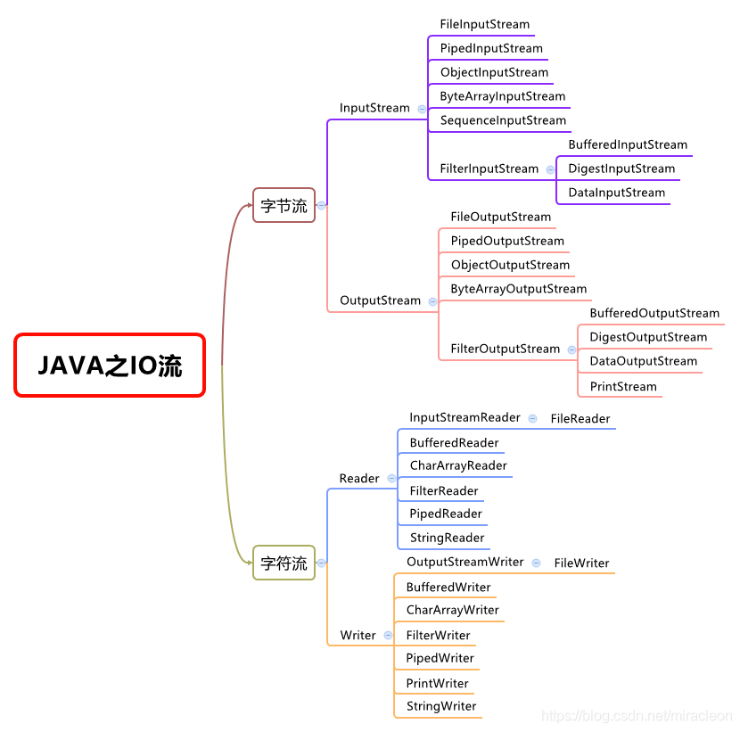

<!-- TOC -->

- [1. IO 流(输入输出流)的概述](#1-io-流输入输出流的概述)
  - [1.1. IO 流的分类](#11-io-流的分类)
    - [1.1.1. IO 流体系中常用流分类表](#111-io-流体系中常用流分类表)
  - [1.2. IO 流常用操作](#12-io-流常用操作)
  - [1.3. IO 流的操作模板](#13-io-流的操作模板)
  - [1.4. IO 流的详细树状图](#14-io-流的详细树状图)

<!-- /TOC -->

## 1. IO 流(输入输出流)的概述
- 这里使用的都是 `java.io` 包中的类.

- IO 指的就是 Input/Output, 即输入和输出.  
  IO 操作是相对的过程, 需要从程序角度进行分析.

### 1.1. IO 流的分类
- IO 流的分类依据:
  - 根据数据单位划分: 字节流和字符流
  - 根据流向划分: 输入流和输出流
  - 根据功能划分: 节点流和包装流  

- IO 中的四大基流:  
  - 字节输出流, 字节输入流, 字符输出流, 字符输入流.  
  - 四大基流都是抽象类, 其它流都是继承于它们的.  
    因此不能创建四大基流的对象, 只能创建其子类对象.  

#### 1.1.1. IO 流体系中常用流分类表
- 注意: 
  - 粗体字标出的类代表节点流, 必须直接与指定的物理节点关联;  
  - 斜体字标出的类代表抽象基类, 无法直接创建实例, 只能创建其子类对象. 

<table>
  <thead>
  <tr>
    <th align="left">分类</th>
    <th align="left">字节输入流</th>
    <th align="left">字节输出流</th>
    <th align="left">字符输入流</th>
    <th align="left">字符输出流</th>
  </tr>
  </thead>
  <tbody>
  <tr>
    <td align="left">抽象基类</td>
    <td align="left"><em>InputStream</em></td>
    <td align="left"><em>OutputStream</em></td>
    <td align="left"><em>Reader</em></td>
    <td align="left"><em>Writer</em></td>
  </tr>
  <tr>
    <td align="left">访问文件</td>
    <td align="left"><strong>FileInputStream</strong></td>
    <td align="left"><strong>FileOutputStream</strong></td>
    <td align="left"><strong>FileReader</strong></td>
    <td align="left"><strong>FileWriter</strong></td>
  </tr>
  <tr>
    <td align="left">访问数组</td>
    <td align="left"><strong>ByteArrayInputStream</strong></td>
    <td align="left"><strong>ByteArrayOutputStream</strong></td>
    <td align="left"><strong>CharArrayReader</strong></td>
    <td align="left"><strong>CharArrayWriter</strong></td>
  </tr>
  <tr>
    <td align="left">访问管道</td>
    <td align="left"><strong>PipedInputStream</strong></td>
    <td align="left"><strong>PipedOutputStream</strong></td>
    <td align="left"><strong>PipedReader</strong></td>
    <td align="left"><strong>PipedWriter</strong></td>
  </tr>
  <tr>
    <td align="left">访问字符串</td>
    <td align="left"></td>
    <td align="left"></td>
    <td align="left"><strong>StringReader</strong></td>
    <td align="left"><strong>StringWriter</strong></td>
  </tr>
  <tr>
    <td align="left">缓冲流</td>
    <td align="left">BufferedInputStream</td>
    <td align="left">BufferedOutputStream</td>
    <td align="left">BufferedReader</td>
    <td align="left">BufferedWriter</td>
  </tr>
  <tr>
    <td align="left">转换流</td>
    <td align="left"></td>
    <td align="left"></td>
    <td align="left">InputStreamReader</td>
    <td align="left">OutputStreamWriter</td>
  </tr>
  <tr>
    <td align="left">对象流</td>
    <td align="left">ObjectInputStream</td>
    <td align="left">ObjectOutputStream</td>
    <td align="left"></td>
    <td align="left"></td>
  </tr>
  <tr>
    <td align="left">滤流(抽象类)</td>
    <td align="left"><em>FilterInputStream</em></td>
    <td align="left"><em>FilterOutputStream</em></td>
    <td align="left"><em>FilterReader</em></td>
    <td align="left"><em>FilterWriter</em></td>
  </tr>
  <tr>
    <td align="left">打印流</td>
    <td align="left"></td>
    <td align="left">PrintStream</td>
    <td align="left"></td>
    <td align="left">PrintWriter</td>
  </tr>
  <tr>
    <td align="left">推回输入流</td>
    <td align="left">PushbackInputStream</td>
    <td align="left"></td>
    <td align="left">PushbackReader</td>
    <td align="left"></td>
  </tr>
  <tr>
    <td align="left">特殊流</td>
    <td align="left">DataInputStream</td>
    <td align="left">DataOutputStream</td>
    <td align="left"></td>
    <td align="left"></td>
  </tr>
  </tbody>
</table>

### 1.2. IO 流常用操作
- IO 流读取和写入操作:  
  - 不论是字节流还是字符流, 都有 `read()` 方法来读取资源
  - 也有 `write()` 方法来写入资源

- IO 流关闭资源:  
  - 每个流中都会存在 `close()` 方法, 用来关闭资源.
  - 如果操作文件后没有关闭资源, 该文件会一直被程序所引用,  
    就会导致它既不能删除, 也不能更改.

### 1.3. IO 流的操作模板

- 创建源或目标对象:  
  - 输入操作: 若要把文件内容输入到程序, 则文件是源
  - 输出操作: 若要把程序数据写入到文件, 则文件是目标

- 创建 IO 流对象:
  - 输入操作: 创建输入流对象
  - 输出操作: 创建输出流对象

- 执行 IO 操作:
  - 输入操作: 输入流对象的 `read()` 方法
  - 输出操作: 输出流对象的 `write()` 方法

- 关闭资源:  
  - 输入操作: 输入流对象的 `close()` 方法
  - 输出操作: 输出流对象的 `close()` 方法
  - 一旦资源对象关闭就不能继续使用流对象了, 否则会出现异常.

### 1.4. IO 流的详细树状图
- 按照四大基流进行划分:  
  