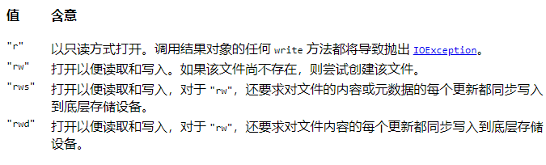

<!-- TOC -->

- [1. 数据流](#1-数据流)
- [2. 随机访问文件(RandomAccessFile)](#2-随机访问文件randomaccessfile)
  - [2.1. 常用方法](#21-常用方法)
  - [2.2. 操作实例](#22-操作实例)

<!-- /TOC -->

## 1. 数据流
- 提供了可以读写任意数据类型的方法.  

- 该流是包装流, 需要在创建时根据流类型提供对应的节点流.

- 根据输入输出类型分为两种流:
  - `DataInputStream` - 提供一系列写入方法 `writeXXX(XXX value)`
  - `DataOutputStream` - 提供一系列读取方法 `readXXX()`
  - 其中 XXX 指的是数据类型, 而且读取和写入时数据类型一定要对应起来.  
    `writeByte(Byte b)` 写入的数据, 必须用 `readByte()` 进行读取.

****

## 2. 随机访问文件(RandomAccessFile)
- 表示可以在指定文件的任何位置进行读写数据.

- 该类同时实现了 `DataInput` 和 `DataOutput` 接口,  
  因此可以同时实现读取和写入操作.

- 调用该方法的读写方法的时候, 需要填写访问模式.  
  访问模式一共分为四种:  
  

- 该流还可以设置文件的大小, 最大可以设置 1G 的大小.  
  如果设置了 1G 大小, 即使文件没有写入数据, 也会占用 1G 的大小.  
  这个方法常用于安卓中的多线程断点下载.

****

### 2.1. 常用方法
- 读取方法: `readXXX()`, 其中 `XXX` 为数据类型
- 写入方法: `writeXXX(XXX val)`, 其中 `XXX` 为数据类型

- 获取文件指针索引位置方法: `long getFilePointer()`
- 改变文件指针指向位置方法: `void seek(long pos)`  
  其中 `pos` 为指定的索引位置.

- 设置文件的大小的方法: `void setLength(long newLength)`


****

### 2.2. 操作实例
```java
public static void main(String[] args){
  File f = new File("file/raf.txt");
  //调用封装好的写入方法
  write(f);
  //调用封装好的读取方法
  read(f);
}

public static void write(File f) throws Exception{
  RandomAccessFile raf = new RandomAccessFile(f, "rw");
  raf.writeByte(65);
  raf.writeUTF("字符串");
  raf.writeInt(11);
  raf.close();
} 

public static void read(File f) throws Exception{
  //创建完随机访问流之后, 文件指针位置索引为 0
  RandomAccessFile raf = new RandomAccessFile(f, "rw");
  //读取完byte数据后, 因为byte数据占1字节, 
  //文件指针位置索引后移到 1
  raf.readByte(65);
  
  //读取完modified Unicode字符数据后, 因为UTF数据占2字节, 
  //同时每个modified Unicode 字符串多占位2字节长度, 
  //文件指针位置索引后移到 9
  raf.writeUTF("字符串");
  
  //读取完int数据后, 因为int数据占2字节, 
  //文件指针位置索引后移到 11
  raf.writeInt(11);
  raf.close();
} 
```