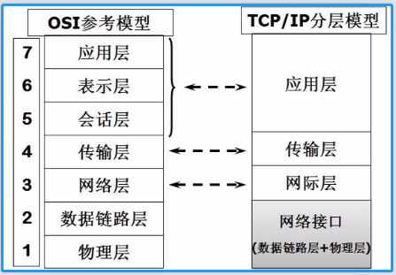
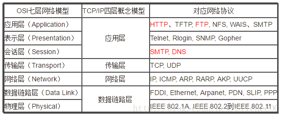
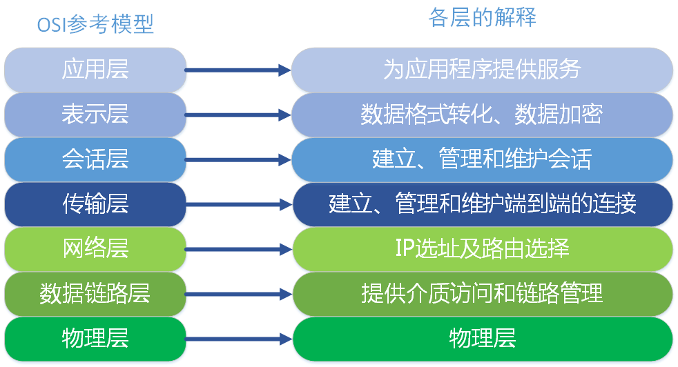
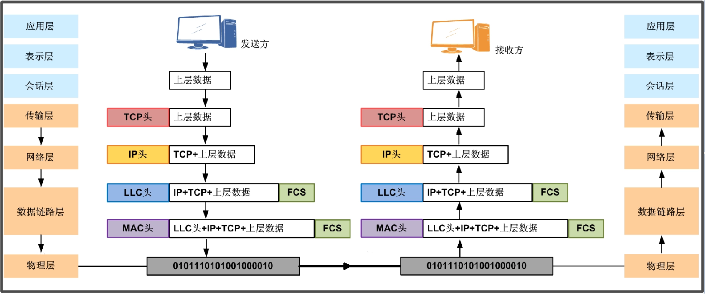

<!-- TOC -->

- [1. 计算机网络](#1-计算机网络)
  - [1.1. 计算机网络的概念](#11-计算机网络的概念)
  - [1.2. 网络分层](#12-网络分层)
  - [1.3. 网络各层常用协议](#13-网络各层常用协议)
    - [1.3.1. OSI 分层模型](#131-osi-分层模型)
  - [1.4. 分层模型各层含义](#14-分层模型各层含义)
    - [1.4.1. 应用层](#141-应用层)
    - [1.4.2. 表示层](#142-表示层)
    - [1.4.3. 会话层](#143-会话层)
    - [1.4.4. 传输层](#144-传输层)
    - [1.4.5. 网络层](#145-网络层)
    - [1.4.6. 数据链路层](#146-数据链路层)
    - [1.4.7. 物理层](#147-物理层)
  - [1.5. 数据封装和拆装的过程](#15-数据封装和拆装的过程)

<!-- /TOC -->

## 1. 计算机网络

### 1.1. 计算机网络的概念
- 计算机网络是指将地理位置不同的具有独立功能的多台计算机及其外部设备,  
  通过通信线路链接起来, 在网络操作系统, 网络管理软件及网络通信协议的管理协调下,  
  实现资源共享和信息传递的计算机系统.

- 从逻辑功能上看, 计算机网络是以传输信息为基础目的,  
  用通信线路将多个计算机连接起来的计算机系统集合,  
  一个计算机网络组成包括传输介质和通信设备.

- 从地理范围对网络类型划分标准, 可以将其划分为四种.  
  分为局域网, 城域网, 广域网和互联网四种.  

****

### 1.2. 网络分层
- 为减少网络设计的复杂性, 绝大多数网络采用分层设计方法.  

- 分层设计就是按照信息的流动过程将网络的整体功能分解为一个个功能层.  
  - 不同机器上的同等功能层之间采用相同的协议,  
  - 同一机器上的相邻功能层之间通过接口进行信息传递.

- 网络分层模型通常为两种, 两种模型本质一样, 只是范围不同:  
  - OSI 七层参考模型
  - TCP/IP 四层参考模型  
  

### 1.3. 网络各层常用协议

#### 1.3.1. OSI 分层模型
- 开放系统互连参考模型(Open System Interconnect)是国际标准化组织(ISO)  
  和国际电报电话咨询委员会(CCITT)联合制定的模型,   
  为开放式互连信息系统提供了一种功能结构框架.

- 该模型从低到高分别是: 物理层, 数据链路层, 网络层, 传输层, 会话层, 表示层和应用层.  

- 通信特点:  
  对等通信是该模型的通信特点, 为了使数据分组从源传送到目的地,  
  源端 OSI 模型的每一层都必须与目的端的对等层进行通信, 这种称为对等层通信.  
  在每一层通信过程中, 使用本层自己协议进行通信.
****

### 1.4. 分层模型各层含义

#### 1.4.1. 应用层
- OSI 参考模型中最靠近用户的一层, 是为计算机用户提供应用接口和各种网络服务.  

- 我们常见应用层的网络服务协议有: HTTP, HTTPS, FTP, POP3, SMTP 等. 

- 类比举例:  
  假设公司 A 的老板就是用户, 而他要发送的商业报价单, 就是应用层提供的一种服务,  
  当然, 老板也可以选择其他服务, 比如说, 发一份商业合同, 发一份询价单, 等等.  

#### 1.4.2. 表示层
- 表示层提供各种用于应用层数据的编码和转换功能,  
  确保一个系统的应用层发送的数据能被另一个系统的应用层识别. 

- 如果必要, 该层可提供一种标准表示形式,  
  用于将计算机内部的多种数据格式转换成通信中采用的标准表示形式. 

- 数据压缩和加密也是表示层可提供的转换功能之一. 

- 类比举例:  
  假设公司 A 和公司 B 是不同国家的公司, 他们之间的商定统一用英语作为交流的语言,  
  所以此时表示层(公司的文秘), 就是将应用层的传递信息转翻译成英语.  
  同时为了防止别的公司看到, 公司 A 的人也会对这份报价单做一些加密的处理.  
  这就是表示的作用, 将应用层的数据转换翻译等. 

#### 1.4.3. 会话层
- 会话层就是负责建立, 管理和终止表示层实体之间的通信会话.  

- 该层的通信由不同设备中的应用程序之间的服务请求和响应组成.       

- 类比举例:  
  会话层的同事拿到表示层的同事转换后的资料, 会话层的同事类似公司的外联部,  
  会话层的同事那里可能会掌握本公司与其他好多公司的联系方式,  
  这里公司就是实际传递过程中的实体. 他们要管理本公司与外界好多公司的联系会话.  
  当接收到表示层的数据后, 会话层将会建立并记录本次会话, 首先要找到公司B的地址,  
  然后将整份资料放进信封, 并写上地址和联系方式. 准备将资料寄出.  
  等到确定公司 B 接收到此份报价单后, 此次会话就算结束了, 外联部就会终止此次会话. 

#### 1.4.4. 传输层
- 传输层建立了主机端到端的链接.  

- 传输层的作用是为上层协议提供端到端的可靠和透明的数据传输服务,  
  包括处理差错控制和流量控制等问题. 

- 该层向高层屏蔽了下层数据通信的细节, 使高层用户看到的只是在两个传输实体间的  
  一条主机到主机的, 可由用户控制和设定的, 可靠的数据通路.   
  通常说的, TCP UDP 就是在这一层. 端口号即是这里的"端". 

- 类比举例:  
  传输层就相当于公司中的负责快递邮件收发的人, 公司自己的投递员,  
  他们负责将上一层的要寄出的资料投递到快递公司或邮局. 

#### 1.4.5. 网络层
- 本层通过 IP 寻址来建立两个节点之间的连接, 为源端的运输层送来的分组,  
  选择合适的路由和交换节点, 正确无误地按照地址传送给目的端的运输层.  

- 就是通常说的 IP 层. 这一层就是我们经常说的 IP 协议层. IP 协议是 Internet 的基础. 

- 类比举例:  
  网络层就相当于快递公司庞大的快递网络, 全国不同的集散中心,  
  比如说, 从深圳发往北京的顺丰快递, 首先要到顺丰的深圳集散中心,  
  从深圳集散中心再送到武汉集散中心, 从武汉集散中心再寄到北京顺义集散中心.  
  这个每个集散中心, 就相当于网络中的一个 IP 节点. 

#### 1.4.6. 数据链路层 
- 将比特组合成字节, 再将字节组合成帧, 使用链路层地址(以太网使用MAC地址)  
  来访问介质, 并进行差错检测. 

- 数据链路层又分为2个子层: 
  - 逻辑链路控制子层(LLC)
  - 媒体访问控制子层(MAC)

- 两个子层的作用:
  - MAC 子层处理 CSMA/CD 算法, 数据出错校验, 成帧等; 
  - LLC 子层定义了一些字段使上次协议能共享数据链路层.  
    在实际使用中, LLC 子层是非必需的. 

#### 1.4.7. 物理层     
- 实际最终信号的传输是通过物理层实现的.  

- 通过物理介质传输比特流. 规定了电平, 速度和电缆针脚.  

- 常用的各种物理设备: 集线器, 中继器, 调制解调器, 网线, 双绞线, 同轴电缆.  
  这些都是物理层的传输介质. 

- 类比举例:  
  快递寄送过程中的交通工具, 就相当于我们的物理层, 例如汽车/火车/飞机/船.

### 1.5. 数据封装和拆装的过程  
  

