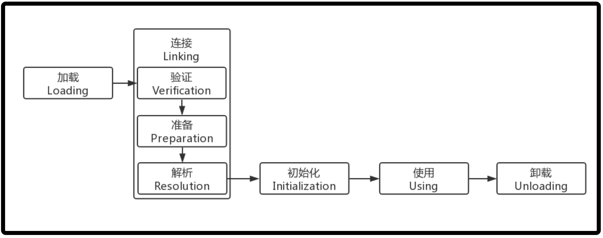

<!-- TOC -->

- [1. 类加载机制](#1-类加载机制)
  - [1.1. JVM 和 类](#11-jvm-和-类)
  - [1.2. 类的加载](#12-类的加载)
    - [1.2.1. 类的个生命周期](#121-类的个生命周期)
    - [1.2.2. 类的加载](#122-类的加载)
    - [1.2.3. 类的连接](#123-类的连接)
    - [1.2.4. 类的初始化](#124-类的初始化)

<!-- /TOC -->

## 1. 类加载机制

### 1.1. JVM 和 类
- 当调用 java 命令来运行某个 Java 程序时, 该命令将会启动一个 JVM 进程.  
  即在控制台中使用 java 命令加上带有 main 方法的类名,  
  即可启动 JVM 加载字节码文件, 启动进程.

- 同一个 JVM 中的所有线程, 变量都处于同一个进程中, 共享该 JVM 的内存区域.

- 当出现以下情况时, JVM 会退出:
  - 程序正常执行结束.
  - 使用 `system.exit(0)` 方法;
  - 出现异常时, 没有捕获异常.
  - 平台强制结束 JVM 进程.(任务管理器关闭进程)

- JVM 进程一旦结束, 该进程中内存中的数据将会丢失.

### 1.2. 类的加载

#### 1.2.1. 类的个生命周期

- 当程序主动使用到某个类时, 如果该类还未被加载进内存中,   
  则系统会通过加载/连接/初始化三个步骤来对该类进行初始化操作.

#### 1.2.2. 类的加载
- 类加载时指将类的 class (字节码文件)载入内存中, 并为之创建 `java.lang.Class` 对象,  
  与这个字节码文件对应的这个对象被称之为字节码对象.

- 类的加载过程由类加载器(`ClassLoader`)完成, 类加载器通常由 JVM 提供,   
  它被称之为系统类加载器, 也可以直接继承 `ClassLoader` 类来提供自定义类加载器.

- 不同的类加载器可以实现加载本地字节码文件, jar 包中的字节码, 通过网络加载字节码等.

#### 1.2.3. 类的连接
- 当类被加载进内存后, 系统为之生成一个 Class 对象, 接着把类的二进制数据合并到 JRE 中.

- 类的连接一共分为三个阶段:
  - 验证: 检测被加载的类是否有正确的内部结构.
  - 准备: 负责为类的 static 变量分配内存并设置默认值.
  - 解析: 把类的二进制数据中的符号引用替换为直接引用.

- 符号引用: 
  - 符号引用是一个字符串, 它给出了被引用的内容的名字,  
    并且可能会包含一些其他关于这个被引用项的信息.  
  - 这些信息必须足以唯一的识别一个类, 字段, 方法.  
    这样, 对于其他类的符号引用必须给出类的全名.

#### 1.2.4. 类的初始化
- 在此阶段 JVM 负责对类进行初始化主要就是对 static 变量进行初始化.

- 初始化一个类一共包含以下三个步骤:
  - 如果该类还未被加载和连接则程序先加载并连接该类.
  - 如果该类的直接父类还未被初始化, 则先初始化其父类.
  - 如果类中有初始化语句(静态代码块), 则系统依次执行这些初始化语句.

