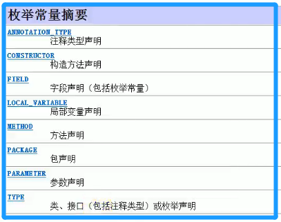

<!-- TOC -->

- [1. 注解(Annotation)](#1-注解annotation)
  - [1.1. 注解的概述](#11-注解的概述)
    - [1.1.1. 注解的用途](#111-注解的用途)
  - [1.2. JDK 自带的注解](#12-jdk-自带的注解)
    - [1.2.1. 作用在代码的注解](#121-作用在代码的注解)
  - [1.3. 作用在其他注解的注解(元注解)](#13-作用在其他注解的注解元注解)
  - [1.4. 注解的定义与使用](#14-注解的定义与使用)
    - [1.4.1. 定义注解的语法](#141-定义注解的语法)
    - [1.4.2. 注解中的抽象方法返回类型限制](#142-注解中的抽象方法返回类型限制)
  - [1.5. 通过反射获取注解](#15-通过反射获取注解)

<!-- /TOC -->

## 1. 注解(Annotation)

### 1.1. 注解的概述
- 从 JAVA5 开始, JAVA 开始对元数据进行支持, 也就是注解(Annotation).  

- 注解被用来为程序元素(类/方法/变量等)设置元数据.

- 元数据(metadata): 描述数据的数据

- 所有的注解(Annotation) 都是 `java.lang.annotation.Annotation` 接口的子接口,  
  所以 Annotation 是一种特殊的接口.

#### 1.1.1. 注解的用途
- 取代臃肿/繁琐的配置文件
****

### 1.2. JDK 自带的注解

#### 1.2.1. 作用在代码的注解
|注解|作用|注意事项|
|--|--|--|
|`@Override`|检查该方法是否是重写方法, 如果发现其父类, </br>或者是引用的接口中并没有该方法时, 会报编译错误.||
|`@Deprecated`|标记过时方法, 如果使用被标记的方法, 会报编译警告.|不推荐使用|
|`@SuppressWarnings`|指示编译器去忽略注解中声明的警告||
|`@SafeVarargs`|忽略任何使用参数为泛型变量的方法或构造函数调用产生的警告.|Java 7 开始支持|
|`@FunctionalInterface`|标识一个匿名函数或函数式接口|Java 8 开始支持|
|`@Repeatable`|标识某注解可以在同一个声明上使用多次|Java 8 开始支持|

****

### 1.3. 作用在其他注解的注解(元注解)

- `@Retention` 元注解  
  - 表示注解可以保存在哪一个时期, 保存时期的常量值,  
    被封装在 `RetentionPolicy` 枚举类中.  

  - 一般来说, 自定义注解, 都使用 `RUNTIME`   
    这样就能在运行时期通过反射赋予注解功能

  - 保存时期分为三种:  
    - `SOURCE`:  
      注解只能存在于源文件中, 编译后就不会出现在字节码文件中
    
    - `CLASS`:  
      注解可以存在源文件和字节码文件中, 但加载进 JVM 后,  
      在 JVM 就找不到这个注解了.
    
    - `RUNTIME`:  
      注解可以存在源文件, 字节码和 JVM 当中.

- `@Target` 元注解
  - 表示注解可以贴在什么位置(类/方法/字段等).  
    位置的常量值被封装在 `ElementType` 枚举类中.

  - 常量值如下图所示:  
    

- 1.3.3. `@Documented` 元注解
  - 使用该标签注解后的标签, 会保存到 API 文档当中.

- `@Inherited` 元注解
  - 被该标签所注解的标签可以被子类所继承

****

### 1.4. 注解的定义与使用

#### 1.4.1. 定义注解的语法
```java
//标注该注解可以贴在什么位置(类/方法/字段等).
@Target(ElementType.TYPE) 
//标注该注解可以保存在哪一个时期
@Retention(RetentionPolicy.SOURCE)
//开始定义注解
public @interface AnnoName{
    //定义抽象方法, 注解中的抽象方法被称为属性
    //定义格式: 返回类型 方法名称();  
    //方法默认值设定(可选): 方法括号后加 default Value
}
```

#### 1.4.2. 注解中的抽象方法返回类型限制
- 基本类型
- String 和 Class 类 
- Annotation 和 Enumeration 的接口实现类
- 以上类型的数组类型

****

### 1.5. 通过反射获取注解
- 注解可以贴在类(Class)/方法(Method)/字段(Field)/构造器(Constructor)等地方上.

- 因此在类(Class)/方法(Method)/字段(Field)/构造器(Constructor)  
  这些类中也拥有获取注解的 API.