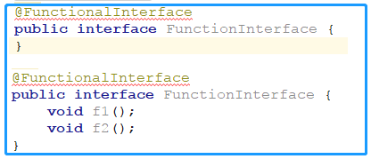
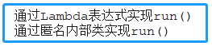
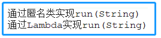

<!-- TOC -->

- [1. Lambda 表达式的概述](#1-lambda-表达式的概述)
  - [1.1. 函数式接口](#11-函数式接口)
  - [1.2. Lambda 表达式](#12-lambda-表达式)
    - [1.2.1. 转换示例](#121-转换示例)
  - [1.3. Lambda 表达式和函数式接口结合](#13-lambda-表达式和函数式接口结合)
    - [1.3.1. 实现步骤](#131-实现步骤)
    - [1.3.2. 实现实例](#132-实现实例)
  - [1.4. 其他形式的函数式接口及实现](#14-其他形式的函数式接口及实现)
    - [1.4.1. 有参无返回值的形式](#141-有参无返回值的形式)
    - [1.4.2. 无参有返回值的形式](#142-无参有返回值的形式)
    - [1.4.3. 有参有返回值](#143-有参有返回值)
- [2. Lambda 表达式详解](#2-lambda-表达式详解)
  - [2.1. 参数列表中的注意事项](#21-参数列表中的注意事项)
  - [2.2. 表达式中的注意事项](#22-表达式中的注意事项)
  - [2.3. 表达式中的变量的注意事项](#23-表达式中的变量的注意事项)
  - [2.4. 函数接口的注意事项](#24-函数接口的注意事项)
  - [2.5. Lambda 表达式中的方法引用](#25-lambda-表达式中的方法引用)
  - [2.6. Lambda 表达式中的构造器引用](#26-lambda-表达式中的构造器引用)

<!-- /TOC -->

## 1. Lambda 表达式的概述
- JAVA8 中加入了函数式编程, 对于并行开发和基于事件开发十分便利.

### 1.1. 函数式接口
- 函数式接口就是只显式声明一个抽象方法的接口.   
- 为保证方法数量不多不少, java8 提供了一个专用注解 `@FunctionalInterface`.  
- 这样, 当接口中声明的抽象方法多于或少于一个时就会报错. 如下图所示:  
  

****

### 1.2. Lambda 表达式

#### 1.2.1. 转换示例
- Lambda 表达式本质上是匿名方法. 先来看下面这个例子:  
```java
public int add(int x, int y) {
    return x + y;
}
```  

- 转成 Lambda 表达式后是这个样子:
```java
(int x, int y) -> x + y;
```

- 参数类型也可以省略, Java 编译器会根据上下文推断出来:  
```java
(x, y) -> x + y; //返回两数之和
```

- 或者可以显示指名返回值:
```java
(x, y) -> { return x + y; } //显式指明返回值
```

- 可见 Lambda 表达式有三部分组成:  
  - 参数列表
  - 箭头（`->`）
  - 一条表达式或一个语句块

****

### 1.3. Lambda 表达式和函数式接口结合

#### 1.3.1. 实现步骤
- 新建无参函数式接口(先演示无参)
- 新建包含属性为函数式接口的类
- 实现函数式接口
- 测试函数式接口的方法

#### 1.3.2. 实现实例
- 新建无参函数式接口
```java
@FunctionalInterface
public interface InterfaceWithNoParam {
    void run();
}
```

- 新建包含属性为函数式接口的类
```java
public class TestJava8{
    InterfaceWithNoParam param;
}
```

- 实现函数式接口
```java
public class TestJava8{
	//匿名内部类的方式进行表示
	InterfaceWithNoParam param1 = new InterfaceWithNoParam() {
        @Override
        public void run() {
            System.out.println("通过匿名内部类实现run()");
        }
    };

	//Lambda表达式进行转换后的表示
    //空括号表示无参
	InterfaceWithNoParam param2 = () -> System.out.println("通过Lambda表达式实现run()") ;
}
```

- 测试函数式接口的方法
```java
@Test
public void testIntfaceWithNoparam() {

    this.param.run();
    this.param1.run();
}
```

- 测试结果   


****

### 1.4. 其他形式的函数式接口及实现
- 上述内容实现了无参无返回值的函数接口与实现, 当然还有其他形式:
  - 有参无返回值
  - 无参有返回值
  - 有参有返回值

#### 1.4.1. 有参无返回值的形式
- 接口
```java
@FunctionalInterface
public interface InterfaceWithParams {
    void run(String s);
}
```

- 实现
```java
InterfaceWithParams params = new InterfaceWithParams() {
    @Override
    public void run(String s) {
        System.out.println("通过" + s + "实现run(String)");
    }
};

InterfaceWithParams params1 = (String s) -> System.out.println("通过" + s + "实现run(String)");
```

- 测试
```java
this.params.run("匿名类");
this.params1.run("Lambda");
```

- 运行  



#### 1.4.2. 无参有返回值的形式
- 接口
```java
@FunctionalInterface
public interface InterfaceUnVoidWithNoParam {
    String run();
}
```

- 实现
```java
InterfaceUnVoidWithNoParam interfaceUnVoidWithNoParam = new InterfaceUnVoidWithNoParam() {
    @Override
    public String run() {
        return "Hello World!";
    }
};
InterfaceUnVoidWithNoParam interfaceUnVoidWithNoParam1 = () -> "Hello Lambda!";
```

- 测试
```java
String s = this.interfaceUnVoidWithNoParam.run();
System.out.println("返回结果是："+s);
String s0 = this.interfaceUnVoidWithNoParam1.run();
System.out.println("返回结果是："+s0);
```

- 运行  


#### 1.4.3. 有参有返回值
- 接口
```java  
@FunctionalInterface
public interface InterfaceUnVoidWithParams {
    String run(Integer integer);
}
```

- 实现
```java
InterfaceUnVoidWithParams interfaceWithParams = new InterfaceUnVoidWithParams() {
    @Override
    public String run(Integer integer) {
        return String.valueOf(integer);
    }
};
InterfaceUnVoidWithParams interfaceWithParams1 = (Integer integer) -> String.valueOf(integer);
```
- 测试
```java    
String s1 = this.interfaceWithParams.run(1);
System.out.println("您输入的是："+s1);
String s2 = this.interfaceWithParams1.run(2);
System.out.println("您输入的是："+s2);
```
- 运行  


## 2. Lambda 表达式详解

### 2.1. 参数列表中的注意事项
- 如果没有参数; 直接用`()`来表示; `()`不能省略;

- 如果只有一个参数，并且参数写了类型，参数外面一定要加`()`;

- 如果只有一个参数，并且参数不写类型，那么这个参数外面可以不用加`()`;

- 如果有两个或多个参数，不管是否写参数类型，都要加`()`; 

- 如果参数要加修饰符或者标签，参数一定要加上完整的类型; 

****

### 2.2. 表达式中的注意事项
- 如果表达式只有一行, 那么可以直接写(不需要`{}`括起来) ;

- 如果表达式有多行, 需要用`{}`变成代码块;

- 如果表达式是代码块, 并且方法需要返回值, 那么，在代码块中就必须返回一个返回值;

- 如果只有单行的情况, 并且方法需要返回值, 不能有 `return`, 编译器会自动帮推导 `return`;

****

### 2.3. 表达式中的变量的注意事项
- Lambda 表达式中的变量:
  - 参数;
  - 局部变量;
  - 自由变量(不是参数也不是局部变量);

- 结论: 
  - Lambda 表达式中的自由变量会被保存到 Lambda 表达式的代码块中,   
    因此无论什么时候执行 Lambda 表达式, 都可直接使用;  
    这个将自由变量进行保存以供后续使用的代码块也被成为闭包;
  
  - 自由变量在 Lambda 表达式中是不能后续修改的(被隐式声明为 `final`);   
  
  - 参数和局部变量的使用方式和普通的变量使用方式相同; 
  
  - Lambda 表达式中的 `this` 指向, 创建 Lambda 表达式的方法中的 `this`;

****

### 2.4. 函数接口的注意事项
- Lambda 表达式一般用于接口的匿名内部类实现, 且接口里面有且只有一个抽象方法;

- 在 Java 中, 把只有一个抽象方法的接口称为函数式接口, 如果一个接口是函数式接口,  
  我们可以在接口上添加`@FunctionalInterface`标签标明这是一个函数式接口;  

- 标签的作用:  
  - 用于自动检查被标记的接口中的抽象方法是否有且只有一个, 若不是, 则做出错误提示.  
  - 用于生成文档的时候能够对该方法进行说明, 说明该接口是函数式接口.

- 但无论是否对函数式接口进行标示`@FunctionalInterface`,   
  只要满足函数式接口的接口, Java 都会直接识别为函数式接口;

- 简化函数式接口的使用是 JAVA 中提供 Lambda 表达式唯一的作用;

- 可以用接口来直接引用一个 Lambda 表达式.

- 接口中可以写 Object 对象中的方法, 并不会影响函数式接口的判断.

- Lambda 表达式中的异常处理方式:  
  - 直接在表达式的代码块中进行 `try-catch` 进行捕获异常;
  - 或者在接口声明的方法中加上 `throws` 将异常上抛上一级方法.

****

### 2.5. Lambda 表达式中的方法引用
- Lambda 表达式中提供了三种形式进行方法引用
  - `类 :: 静态方法`
  - `对象 :: 方法`
  - `对象 :: 静态方法`

****

### 2.6. Lambda 表达式中的构造器引用
- `类 :: new`