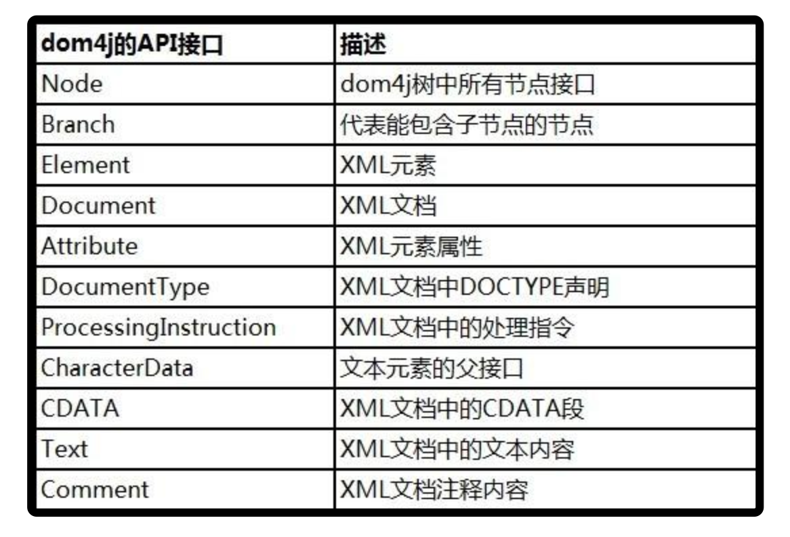

<!-- TOC -->

- [1. DOM4J 的概述](#1-dom4j-的概述)
  - [1.1. DOM4J 的导入](#11-dom4j-的导入)
  - [1.2. DOM4J 中的 API 接口](#12-dom4j-中的-api-接口)
  - [1.3. DOM4J 中常用的 API](#13-dom4j-中常用的-api)
  - [1.4. DOM4J 中的 Element 类常用方法](#14-dom4j-中的-element-类常用方法)
  - [1.5. DOM4J 操作实例](#15-dom4j-操作实例)

<!-- /TOC -->

## 1. DOM4J 的概述
- DOM4J 是一个 java 的 XML API, 是 JDOM 的升级品, 用来更便捷地读取 XML 文件.

****

### 1.1. DOM4J 的导入
- 开发引入:  
  把 dom4j.jar 添加到项目的 lib 目录中，并 [build path].

- 使用方式:  
  阅读 dom4j/docs/index.html --> 导航栏选择 [Quick start] --> guide.html

- 注意:  
  - 使用 DOM4J, 使用到的所有的接口/类(Document, Element),全部来源于 org.dom4j 包.
  - 使用 DOM4J, 只能一层一层的往下找.

****

### 1.2. DOM4J 中的 API 接口


****

### 1.3. DOM4J 中常用的 API
- org.dom4j.io.SAXReader 类
  - `read()` 方法: 提供多种读取xml文件的方式，返回一个Domcument对象
 
- org.dom4j.Document 类
  - `iterator()` 方法: 使用此法获取node
  - `getRootElement()` 方法: 获取根节点

- org.dom4j.Node 类
  - `getName()` 方法: 获取 node 名字，例如获取根节点名称为 bookstore
  
  - `getNodeType()` 方法: 获取 node 类型常量值，例如获取到 bookstore 类型为 1——Element
  
  - `getNodeTypeName()` 方法: 获取 node 类型名称，例如获取到的 bookstore 类型名称为 Element

- org.dom4j.Element 类
  - `attributes()` 方法: 返回该元素的属性列表
  
  - `attributeValue()` 方法: 根据传入的属性名获取属性值
  
  - `elementIterator()` 方法: 返回包含子元素的迭代器
  
  - `elements()` 方法: 返回包含子元素的列表

- org.dom4j.Attribute 类
  - `getName()` 方法: 获取属性名
  
  - `getValue()` 方法: 获取属性值

- org.dom4j.Text 类
  - `getText()` 方法: 获取Text节点值

- org.dom4j.CDATA 类
  - `getText()` 方法: 获取CDATA Section值

- org.dom4j.Comment
  - `getText()` 方法: 获取注释
****

### 1.4. DOM4J 中的 Element 类常用方法
<html>
 <head></head>
 <body>
  <table> 
   <tbody> 
    <tr> 
     <td> <p>getQName()</p> </td> 
     <td> <p>元素的 QName 对象</p> </td> 
    </tr> 
    <tr> 
     <td> <p>getNamespace()</p> </td> 
     <td> <p>元素所属的 Namespace 对象</p> </td> 
    </tr> 
    <tr> 
     <td> <p>getNamespacePrefix()</p> </td> 
     <td> <p>元素所属的 Namespace 对象的 prefix</p> </td> 
    </tr> 
    <tr> 
     <td> <p>getNamespaceURI()</p> </td> 
     <td> <p>元素所属的 Namespace 对象的 URI</p> </td> 
    </tr> 
    <tr> 
     <td> <p>getName()</p> </td> 
     <td> <p>元素的 local name</p> </td> 
    </tr> 
    <tr> 
     <td> <p>getQualifiedName()</p> </td> 
     <td> <p>元素的 qualified name</p> </td> 
    </tr> 
    <tr> 
     <td> <p>getText()</p> </td> 
     <td> <p>元素所含有的 text 内容, 如果内容为空则返回一个空字符串而不是 null</p> </td> 
    </tr> 
    <tr> 
     <td> <p>getTextTrim()</p> </td> 
     <td> <p>元素所含有的 text 内容, 其中连续的空格被转化为单个空格, 该方法不会返回 null</p> </td> 
    </tr> 
    <tr> 
     <td> <p>attributeIterator()</p> </td> 
     <td> <p>元素属性的 iterator, 其中每个元素都是 Attribute 对象</p> </td> 
    </tr> 
    <tr> 
     <td> <p>attributeValue()</p> </td> 
     <td> <p>元素的某个指定属性所含的值</p> </td> 
    </tr> 
    <tr> 
     <td> <p>elementIterator()</p> </td> 
     <td> <p>元素的子元素的 iterator, 其中每个元素都是 Element 对象</p> </td> 
    </tr> 
    <tr> 
     <td> <p>element()</p> </td> 
     <td> <p>元素的某个指定(qualified name 或者 local name)的子元素</p> </td> 
    </tr> 
    <tr> 
     <td> <p>elementText()</p> </td> 
     <td> <p>元素的某个指定(qualified name或者 local name)的子元素中的 text 信息</p> </td> 
    </tr> 
    <tr> 
     <td> <p>getParent</p> </td> 
     <td> <p>元素的父元素</p> </td> 
    </tr> 
    <tr> 
     <td> <p>getPath()</p> </td> 
     <td> <p>元素的 XPath 表达式, 其中父元素的 qualified name 和子元素的 qualified name 之间使用&quot;/&quot;分隔</p> </td> 
    </tr> 
    <tr> 
     <td> <p>isTextOnly()</p> </td> 
     <td> <p>是否该元素只含有 text 或是空元素</p> </td> 
    </tr> 
    <tr> 
     <td> <p>isRootElement()</p> </td> 
     <td> <p>是否该元素是 XML 树的根节点</p> </td> 
    </tr> 
   </tbody> 
  </table>
 </body>
</html>

****

### 1.5. DOM4J 操作实例
- 以如下的 XML 为例子进行实例操作:  
```xml
<html>
    <head>
        <title>解析xml例子</title>
        <script>
            <username>yangrong</username>
            <password>123456</password>
        </script>
    </head>
    <body>
        <result>0</result>
        <form>
            <banlce>1000</banlce>
            <subID>36242519880716</subID>
        </form>
    </body>
</html>
```

- 操作的 java 代码如下:  
```java
import java.util.HashMap;
import java.util.Iterator;
import java.util.Map;
import java.util.List;
import java.io.ByteArrayInputStream;
import java.io.File;
import java.io.FileOutputStream;
import java.io.FileWriter;
import java.io.OutputStreamWriter;
import java.io.UnsupportedEncodingException;
import java.net.URL;
import org.dom4j.Document;
import org.dom4j.DocumentException;
import org.dom4j.DocumentHelper;
import org.dom4j.Element;
import org.dom4j.io.OutputFormat;
import org.dom4j.io.SAXReader;
import org.dom4j.io.XMLWriter;

import com.alibaba.fastjson.JSON;

public class OperateXml {

    @SuppressWarnings("unused")
    public static void main(String[] args) {
        // 下面是需要解析的xml字符串例子
        String xmlString = "<html><head><title>解析xml例子</title><script><username>yangrong</username><password>123456</password></script></head><body><result>0</result><form><banlce>1000</banlce><subID>36242519880716</subID></form></body></html>";
        //主动创建document对象.
        Document document=DocumentHelper.createDocument();//建立document对象，用来操作xml文件
        
        Document testdoc=DocumentHelperreadStringXml(xmlString);
        //将文档或节点的XML转化为字符串.
        String docXmlText=testdoc.asXML();
        String teststring=Documentanalysis1(testdoc);
        System.out.print(teststring);
    }

    public static Document DocumentHelperreadStringXml(String xmlContent) {
        // DocumentHelper 解析xml字符串
        Document document = null;
        try {
            document = DocumentHelper.parseText(xmlContent);
        } catch (DocumentException e1) {
            // TODO Auto-generated catch block
            e1.printStackTrace();
        }
        return document;
    }

    public static Document SAXReaderreadStringXml(String xmlContent)
            throws DocumentException, UnsupportedEncodingException {
        /* SAXReader解析xml字符串 */
        Document document = null;
        try {
            // 读取输入流
            SAXReader saxReader = new SAXReader();
            document = saxReader.read(new ByteArrayInputStream(xmlContent.getBytes("utf-8")));// 字符串要根据相应的编码转成输入流才能被SAXReader读取。
        } catch (Exception ex) {
            ex.printStackTrace();
        }
        return document;

    }

    // 读写XML文档主要依赖于org.dom4j.io包，有DOMReader和SAXReader两种方式。因为利用了相同的接口，它们的调用方式是一样的。
    public static Document SAXReaderreadfile(String filename) {
        /* SAXReader解析xml文件 */
        Document document = null;
        try {
            SAXReader saxReader = new SAXReader();
            document = saxReader.read(new File(filename)); // 读取XML文件,获得document对象
        } catch (Exception ex) {
            ex.printStackTrace();
        }
        return document;
    }

    public static Document SAXReaderreadurl(URL url) {
        Document document = null;
        try {
            SAXReader saxReader = new SAXReader();
            document = saxReader.read(url); // 读取XML文件,获得document对象
        } catch (Exception ex) {
            ex.printStackTrace();
        }
        return document;
    }

    // 根节点是xml分析的开始，任何xml分析工作都需要从根开始
    @SuppressWarnings("unchecked")
    public static String Documentanalysis1(Document doc) {
        Map<String, String> uploadMap = new HashMap<String, String>();
        Element html = doc.getRootElement();// 获取根结点
        Element head = html.element("head");// 获取子结点
        Element title = head.element("title");// 获取子子结点
        Element script = head.element("script");// 获取子子结点
        String text=script.elementText("username");//这个是取得script节点下的username字节点的文字.
        // 得到根元素的所有子节点
        List<Element> elist = script.elements();
        // 遍历所有子节点
        for (int i = 0; i < elist.size(); i++) {
            Element e = elist.get(i);
            uploadMap.put(e.getName(), e.getText());
        }
        return JSON.toJSONString(uploadMap);
    }

    @SuppressWarnings("rawtypes")
    public static String Documentanalysis2(Document doc) {
        // 将解析结果存储在HashMap中
        Map<String, String> uploadMap = new HashMap<String, String>();
        // 得到xml根元素
        Element root = doc.getRootElement();
        Iterator forms = root.element("body").element("form").elementIterator(); // 获取ticketNotify节点下所有的ticket节点的配置属性，并将其放到Map中
/*        // 创建迭代器，用来查找要删除的节点,迭代器相当于指针，指向root下所有的title节点
        Iterator iterator =root.elementIterator("title");*/
        while (forms.hasNext()) {
            Element e = (Element) forms.next();
            uploadMap.put(e.getName(), e.getText());
        }
        return JSON.toJSONString(uploadMap);
    }

    @SuppressWarnings("unchecked")
    public static String Documentanalysis3(Document doc) {
        // 将解析结果存储在HashMap中
        Map<String, String> uploadMap = new HashMap<String, String>();
        // 用Document的selectNodes来读取节点，返回list
        List<Element> elementList = doc.selectNodes("/html/body/form/*");
　　　　　　/* 选取未知节点
　　　　　　XPath 通配符可用来选取未知的 XML 元素。

　　　　　　通配符 　　　　描述
　　　　　　*      　　匹配任何元素节点。
　　　　　　@*      　 匹配任何属性节点。
　　　　　　node() 　　匹配任何类型的节点。*/

        for (Element e : elementList) {
            uploadMap.put(e.getName(), e.getText());
        }
        return JSON.toJSONString(uploadMap);
    }

    // 添加xml节点，addroot为即将插入节点的父节点
    public static void addElement(Element addroot, String elementname, String elementvalue) {
        Element childelement = addroot.addElement(elementname);
        childelement.setText(elementvalue);

    }
    // 删除xml节点，addroot为即将删除节点的父节点
        public static void addElement(Element addroot, String elementname) {
             addroot.remove(addroot.element(elementname));
            
        }

    //写入XML文件,可设置编码方式设置encodetype为""，默认为UTF-8
    public static boolean doc2XmlFile(Document document, String filename,String encodetype) {
        boolean flag = true;
        try {
            //通过XMLWriter将Document对象表示的XML树写入指定的文件
            XMLWriter writer = new XMLWriter(new OutputStreamWriter(new FileOutputStream(filename), "".equals(encodetype)?"UTF-8":encodetype));
            writer.write(document);
            writer.close();
        } catch (Exception ex) {

            flag = false;
            ex.printStackTrace();
        }
        System.out.println(flag);
        return flag;
    }
    
    //创建xml文件
    public static void WriterXmltoFile(Document document, String filename,String encodetype) {
        OutputFormat format = OutputFormat.createPrettyPrint();
        format.setEncoding(encodetype); // 指定XML编码
        try{

        XMLWriter writer=new XMLWriter(new FileWriter(new File(filename)),format);

        writer.write(document);

        writer.close();

        }catch(Exception e){

        e.printStackTrace();

        }
    }

}
```